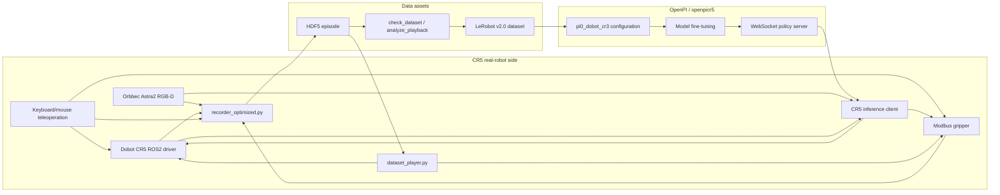
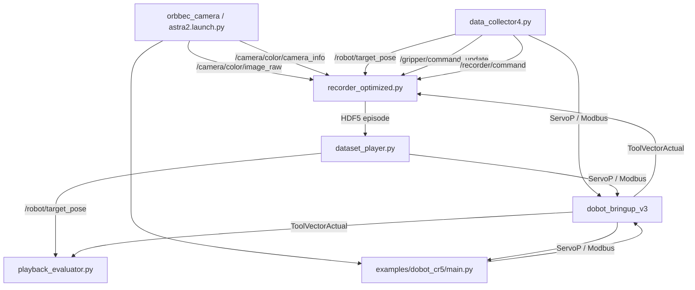
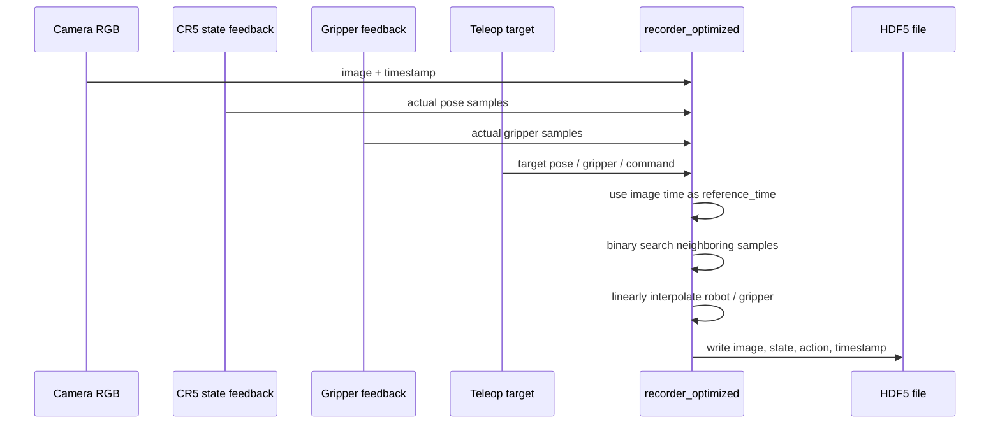
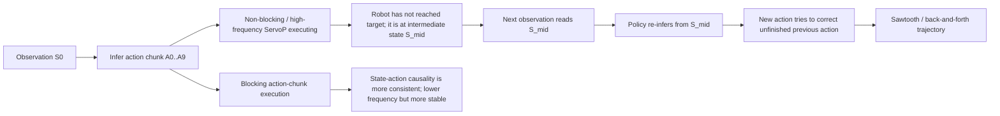



## TL;DR
- **Problem:** A VLA policy cannot be moved onto a real robot by training code alone. It needs calibrated sensing, stable robot control, synchronized data, dataset validation, model-serving infrastructure, and safety boundaries.
- **Method:** Built a ROS2 Humble real-robot loop for **Dobot CR5**, **Orbbec Astra2 RGB-D**, and an **electric gripper**, then connected HDF5 recording, LeRobot v2.0 conversion, OpenPI fine-tuning, WebSocket serving, and a CR5 inference client.
- **Result:** Established a safety-checked real-machine pipeline from teleoperation recording to inference. Camera frame drops were reduced from **27.15%** to **2.57%-4.74%**, and the final inference path favored action chunks plus **blocking ServoP** execution for stability.

## Real-Robot Effect Demos

| Towel Folding Task | Grasping Task |
| --- | --- |
|  |  |

## Open-Source Repositories

| Repository | Role |
| --- | --- |
| [openpicr5](https://github.com/Bill-xing/openpicr5) | OpenPI-derived VLA adaptation, Dobot policy mapping, training configuration, WebSocket policy server, and CR5 inference client. |
| [DOBOT_6Axis_ROS2_V3](https://github.com/Bill-xing/DOBOT_6Axis_ROS2_V3) | Dobot CR-series ROS2 driver base plus real-robot data collection, playback, conversion, and safety tooling work. |
| [ros2_ws_xing](https://github.com/Bill-xing/ros2_ws_xing) | Optimized camera/recorder launch scripts, Fast DDS shared memory configuration, and high-throughput recording workflow. |

## Detailed Technical Report

# CR5 Real-Robot Adaptation Report for VLA/OpenPI

## 0. Executive Summary

This project builds a real-robot VLA/OpenPI loop around a Dobot CR5, an Orbbec Astra2 RGB-D camera, and an electric gripper. The implemented loop covers:

- CR5 driver startup under ROS2 Humble, ServoP servo control, and Modbus gripper control.
- Orbbec camera startup, RGB image capture, camera-intrinsics inspection, and camera-throughput optimization.
- Eye-to-hand calibration, with the final static TF published as `base_link -> camera_color_optical_frame`.
- Keyboard and mouse teleoperation, including robot target commands, gripper target commands, and recording control commands.
- HDF5 data recording. The camera frame is used as the master clock, and robot/gripper states are interpolated to image timestamps.
- HDF5 to LeRobot v2.0 conversion, producing Parquet files, MP4 videos, `info.json`, `stats.json`, `episodes.jsonl`, and `tasks.jsonl`.
- Dataset playback, safety checks, playback-error evaluation, and dataset-quality inspection.
- OpenPI/openpicr5 Dobot data adaptation, the `pi0_dobot_cr3` training configuration, a WebSocket policy server, and a CR5 inference client.

Important factual notes:

1. Many names still use `cr3`, while the notes and the target hardware are CR5. This is a historical naming artifact. The OpenPI configuration `pi0_dobot_cr3`, policy file `dobot_cr3_policy.py`, and conversion default `robot_type='dobot_cr3'` do not mean the hardware is CR3. The real robot in the notes and inference client is CR5.
2. The checked-out `main` branch of `DOBOT_6Axis_ROS2_V3` is mainly the official/base code. Much of the real-robot recording, playback, evaluation, and conversion work lives on the remote `origin/server` branch.
3. The `main` branch of `openpicr5` keeps the CR5 inference client and training configuration. The `origin/read` branch contains more aggressive experiments: parallel execution, independent ServoP processes, inference-latency analysis, ServoP-latency analysis, and server warmup. The `origin/single` branch records a fallback toward a single-process or more serial execution route.
4. Parallel inference and independent ServoP execution did not become the final path. Non-blocking execution can increase apparent frequency, but it lets the model infer from intermediate robot states before the previous action chunk has finished. This causes back-and-forth trajectory corrections. Independent processes reduce part of the ServoP call latency, but queue synchronization and DDS/controller bottlenecks absorb much of the benefit.
5. The most stable current real-robot inference strategy is not maximum frequency. It is action chunks plus blocking ServoP, interpretable latency statistics, and explicit safety boundaries.

The overall loop:



## 1. Hardware, System, and ROS2 Base

### 1.1 Hardware

The real-robot platform:

- Robot arm: Dobot CR5.
- Camera: Orbbec Astra2 RGB-D camera.
- Gripper: controlled through the Dobot controller's Modbus RTU interface. The notes also reference AG-series and DH electric-gripper materials.
- Host: Ubuntu 22.04 + ROS2 Humble.
- Training/inference server: OpenPI environment, either local or on a remote GPU server.

### 1.2 ROS2 Packages

Robot-side packages:

- `DOBOT_6Axis_ROS2_V3/dobot_bringup_v3`
- `DOBOT_6Axis_ROS2_V3/dobot_msgs_v3`
- `DOBOT_6Axis_ROS2_V3/cr5_moveit`
- `DOBOT_6Axis_ROS2_V3/dobot_demo`

Camera-side packages:

- `OrbbecSDK_ROS2/orbbec_camera`
- `OrbbecSDK_ROS2/orbbec_camera_msgs`
- `OrbbecSDK_ROS2/orbbec_description`

Camera, RViz, and MoveIt deployment screenshots:


### 1.3 ROS Topics

Camera topics recorded in the notes:

```text
/camera/color/image_raw
/camera/color/camera_info
/camera/depth/image_raw
/camera/depth/camera_info
/camera/depth/points
/camera/ir/image_raw
/camera/ir/camera_info
/camera/gyro_accel/sample
/tf
/tf_static
```

Additional topics used by the VLA recording and inference loop:

```text
/dobot_msgs_v3/msg/ToolVectorActual   # current robot end-effector pose
/robot/target_pose                    # target end-effector pose from teleop/playback/inference
/gripper/command_update               # target gripper command
/gripper/state_feedback               # actual gripper feedback
/recorder/command                     # recording control: start, save, discard
```

`ToolVectorActual` was later changed to include a header timestamp. This is critical for aligning camera frames with real robot states.

ROS2 data-plane and control-plane relationships:



## 2. Camera Configuration and Hand-Eye Calibration

### 2.1 Camera Model and Intrinsics

The notes identify the camera as Orbbec Astra2. The camera SDK/ROS2 node publishes `CameraInfo`; intrinsics come from camera firmware rather than from a hand-written local parameter file.

Recorded RGB camera information:

| Field | Value |
| --- | --- |
| Image size | 640 x 480 |
| `fx` | 503.705078125 |
| `fy` | 503.6905517578125 |
| `cx` | 320.5251159667969 |
| `cy` | 243.20379638671875 |
| Distortion model | `plumb_bob` |

During hand-eye calibration, three parameter groups mattered:

- RGB camera intrinsic matrix.
- IR camera intrinsic matrix.
- Transform between RGB and IR/depth.

Astra2 RGB and IR streams each use their own coordinate frame. The RGB-IR/depth relationship can be obtained through `/tf`. Depth-to-color alignment can be performed in hardware or software. Hardware D2C has lower latency and lower CPU load, but is constrained by firmware parameters and resolution. Software D2C is more flexible, but has higher real-time compute cost.

### 2.2 `CameraInfo` Distortion Parameter Format

MoveIt calibration and other ROS vision tools often assume the `plumb_bob` model has five distortion parameters. Orbbec `CameraInfo.d` may publish eight parameters. The notes explicitly record that early coordinate computation did not actually load camera intrinsics because the expected camera-info format differed from the Orbbec camera-info format.

The helper `fix_camera_info.py` was added. Core behavior:

1. Subscribe to `CameraInfo`.
2. Preserve only the first five distortion parameters.
3. Republish a `plumb_bob`-compatible message.

Engineering caveat: using the same topic name for input and output in ROS2 should be handled carefully. A safer design is to publish the camera driver output to a raw topic and publish the normalized message on a standard topic. The actual notes used same-name replacement, so the report records it as-is rather than rewriting history.

### 2.3 Intrinsic Calibration and Accuracy

The notes tried:

- ROS camera calibration tools.
- MATLAB calibration tools.
- Calibration-board images.
- Disabling the IR projector before image capture because the infrared pattern created many bright points and interfered with corner extraction.

Reprojection error was used as the accuracy criterion:

- 0.1 to 0.5 pixel: strong for industrial usage.
- Greater than 1.0 pixel: not trustworthy, and the board, blur, reflection, or capture conditions should be checked.

MATLAB calibration can remove samples with high reprojection error and recalibrate. The practical bottleneck was not MATLAB itself, but board quality and image capture conditions.

### 2.4 Eye-to-Hand Calibration

The CR5 setup uses an eye-to-hand camera. The target transform is:

```text
base_link -> camera_color_optical_frame
```

Two methods appear in the notes:

1. Early approximate method: no calibration board, two nearby points, and a least-squares estimate of the relationship between robot base and camera frame. The conclusion was that it is acceptable only when the end-effector stays fixed, but it is not strict calibration.
2. MoveIt calibration: RViz plugin with multiple hand-eye algorithms. It does not require manually obtaining the transform from calibration board to link6.

The saved static transform in `camera_base.launch.py` publishes translation in meters and orientation as a quaternion. This transform converts points from camera coordinates to the robot base frame, and it is the spatial basis for vision-based grasping, point-cloud understanding, and image/action consistency in VLA data.

Hand-eye calibration chain:


Calibration screenshots:


### 2.5 Current Calibration Conclusion

The final notes are pragmatic: the MoveIt calibration route is currently acceptable, but there are still bugs and reprojection error is too large. To improve accuracy, the next calibration iteration should enlarge the calibration pattern, use more accurate measurement tools, choose better calibration poses, and disable or control infrared projection.

The right conclusion is not "high-precision calibration is complete." A usable static TF exists for fixed-view RGB-based VLA data collection and inference. If the project later relies on depth point clouds for precise 3D grasp-point computation, high-quality recalibration and error evaluation are required.

## 3. Teleoperation and Data Collection Control

### 3.1 Teleoperation Sources

The notes reference XLeRobot keyboard teleoperation and OpenTeleVision/Meta Quest3 VR teleoperation. The implemented mainline path is keyboard and mouse teleoperation; VR remains a reference or exploration route.

Files on `origin/server` include:

```text
DOBOT_6Axis_ROS2_V3/dobot_demo/dobot_demo/data_collector4.py
DOBOT_6Axis_ROS2_V3/dobot_demo/dobot_demo/gripper_comm.py
DOBOT_6Axis_ROS2_V3/dobot_demo/dobot_demo/gripper_config.py
```

### 3.2 `data_collector4.py` Architecture

`data_collector4.py` is a core script for teleoperation and recording control. It does more than keyboard motion. It handles:

- Robot ServoP control.
- Gripper Modbus control.
- Publishing robot target state.
- Publishing gripper target and feedback state.
- Publishing recording start/save/discard commands.

The ROS node is:

```text
teleop_node
```

Service-client categories:

| Category | Service Interfaces |
| --- | --- |
| Robot enable and state | `EnableRobot`, `ClearError`, `SpeedFactor` |
| Motion control | `MovJ`, `MovL`, `ServoJ`, `ServoP`, `Sync` |
| State reading | `GetPose`, `GetAngle` |
| Gripper Modbus | `ModbusCreate`, `ModbusClose`, `SetHoldRegs`, `GetHoldRegs` |

Published topics:

```text
/robot/target_pose
/gripper/command_update
/gripper/state_feedback
/recorder/command
```

### 3.3 Gripper Control

The gripper is controlled through the Dobot controller's Modbus interface:

- IP: `192.168.5.1`
- Port: `60000`
- Slave ID: `1`
- RTU mode: `is_rtu = 1`

Common registers:

```text
256: enable register
257: force/speed
259: target position
514: current position feedback
```

`GripperComm` performs low-level register reads/writes. `GripperManager` runs as an independent thread and manages incremental mouse control, non-blocking Modbus writes, real-position reads after button release, and automatic target-position updates.

A practical problem appears in the notes: actual gripper readback is slow. The target may be 50Hz or 100Hz, but real Modbus readback often stays around 10Hz. Playback and recording therefore use linear interpolation so low-frequency gripper feedback can be published at a smoother higher rate.

### 3.4 Recording Control Shortcuts

`data_collector4.py` publishes `Int32` commands on `/recorder/command`:

- `1`: start recording.
- `2`: stop and save.
- `0`: stop and discard.

An important safety and consistency change is that the robot returns to the initial pose at recording start and end, then the recording command is issued. This reduces episode start/end inconsistency and lowers the risk of sudden jumps during playback.

## 4. Data Recording Pipeline

### 4.1 Recording Targets

For VLA/OpenPI, recording is not just video capture. The dataset must contain:

- Image: camera RGB frames.
- State: actual robot 6D end-effector pose.
- Action: target robot 6D end-effector pose sent by the teleoperator/controller.
- Gripper state: actual gripper opening.
- Gripper action: target gripper opening.
- Timestamp: for aligning each frame.
- Camera intrinsics: for later geometry checks or vision tasks.

Final HDF5 structure:

```text
observations/images/color      [N, H, W, 3], uint8
observations/images/depth      optional, [N, H, W]
observations/robot_current     [N, 6]
observations/gripper_current   [N, 1]
actions/robot_target           [N, 6]
actions/gripper_target         [N, 1]
timestamps                     [N]
camera_info/intrinsics         [3, 3]
camera_info/distortion         [5]
metadata/*
```

HDF5 tree record:


### 4.2 Data Sources

The recorder subscribes to:

```text
/camera/color/image_raw
/camera/color/camera_info
/camera/depth/image_raw         # optional
/dobot_msgs_v3/msg/ToolVectorActual
/robot/target_pose
/gripper/command_update
/gripper/state_feedback
/recorder/command
```

Actual robot state is published by the Dobot feedback node. Target state is mirrored by teleoperation, playback, or the inference client. This lets the dataset save both actual state and action command, instead of losing supervised-action information.

### 4.3 `recorder_optimized.py`

`ros2_ws_xing/recorder_optimized.py` was designed to reduce frame drops and CPU load in the original recording flow.

Optimizations:

- ROS callbacks only enqueue lightweight data; they do not perform image conversion or HDF5 writes.
- A processing thread handles pending frames.
- `deque(maxlen=...)` keeps short ordered windows for messages.
- Binary search aligns timestamps instead of linear scanning.
- Robot and gripper states are linearly interpolated.
- Depth recording is disabled by default because depth conversion and compression are expensive.
- HDF5 saving uses gzip compression and chunks.

Key buffer settings:

```text
image_queue_size = 10
state_queue_size = 2000
processing_queue_size = 200
compression = gzip
chunks = True
```

The camera frame timestamp is the reference time. For each RGB frame, the recorder finds the robot-state samples before and after that timestamp, interpolates the 6D pose, and performs the same process for gripper feedback and target commands. Therefore, the dataset frame rate equals the retained camera-frame rate.

Recording timeline:



Recorder code and runtime logs:


### 4.4 Camera Frame Rate and Fast DDS Shared Memory

The notes record a typical throughput problem:

- Target camera frame rate: 30Hz.
- After starting control and recording nodes, actual camera rate dropped to around 20Hz.
- Early datasets had a frame-drop rate of **27.15%**, maximum interval **899.75ms**, and poor quality.

Initial frame-drop analysis:

```text
actual frames: 660
recording duration: 30.21 s
expected frames: 906
frame-drop rate: 27.15%
average interval: 45.84 ms
maximum interval: 899.75 ms
standard deviation: 73.11 ms
VLA training suitability: poor, not recommended
```

The optimization was Fast DDS shared memory. The camera launch kept only RGB enabled and disabled depth, IR, and point cloud. The optimized launch path is `start_recording_optimized.sh` with `camera_recorder_optimized.launch.py`.

After shared-memory optimization:

```text
actual frames: 796
recording duration: 27.26 s
expected frames: 817
dropped frames: 21
frame-drop rate: 2.57%
average interval: 34.29 ms
maximum interval: 99.98 ms
standard deviation: 6.29 ms
VLA training suitability: good, use carefully
```

Another episode:

```text
total frames: 1125
total duration: 39.39 s
average frame rate: 28.6 Hz
frame-drop rate: 4.74%
maximum interval: 199.97 ms
position jumps: normal
rotation jumps: normal
gripper changes: normal
3 high-speed motion points found
dataset mostly usable, recommended careful playback
```

Conclusion: Fast DDS shared memory removed the main throughput bottleneck, but it does not guarantee zero drops. Current data quality can support selected training and validation, but high-quality VLA fine-tuning still requires per-episode screening.

Frame-rate record:


## 5. Time Alignment Between Camera and Robot Data

### 5.1 Why Hard Synchronization Was Not Used

`ApproximateTimeSynchronizer` appears in the notes. It can align messages, but it has problems in this setting:

- The camera is around 30Hz.
- Robot state can be much faster.
- Gripper feedback can be much slower, often around 10Hz.
- Strict synchronization drops frames when one source is late.
- For VLA, every RGB frame is valuable, so dropping camera frames just to satisfy strict sync is undesirable.

### 5.2 Current Alignment Strategy

The current strategy is camera-time-dominant interpolation:

1. Keep all incoming robot-state and gripper-state samples in timestamped queues.
2. When an RGB frame arrives, use its timestamp as `reference_time`.
3. Find the previous and next robot samples around that time.
4. Linearly interpolate position and Euler-angle state.
5. Do the same for gripper feedback and command state.
6. Save one aligned row to HDF5.

Interpolation logic:

```text
ratio = (t_ref - t0) / (t1 - t0)
value_ref = value0 + ratio * (value1 - value0)
```

Advantages:

- Keeps the camera frame as the dataset main clock.
- Avoids dropping image frames because of slow gripper feedback.
- Produces state/action arrays with the same length as the image sequence.
- Matches LeRobot/OpenPI assumptions more naturally.

Limitations:

- If the robot moves rapidly, linear interpolation can introduce error.
- If a state sample is too far away from the image timestamp, the frame should be marked lower quality.
- Euler-angle interpolation can be discontinuous near wrap-around, so quaternion or rotation-vector interpolation would be better for future work.

### 5.3 ROS Time Choice

The notes record a bug where `time.time()` was mixed with ROS message timestamps. The final direction is to use ROS time consistently, especially for:

- `Image.header.stamp`.
- `ToolVectorActual.header.stamp`.
- Gripper target and feedback message headers.
- Recorder reference timestamps.

### 5.4 Inference-Time Alignment

During inference, strict synchronization is less important than freshness:

- The image should be recent.
- Robot state should be recent.
- Gripper state should be recent.
- Old observations should be discarded or rejected.

The inference client should log `image_age_ms` and `state_age_ms`, so operators can judge whether the policy is acting on stale observations.

## 6. Dataset Quality and Safety Checks

### 6.1 `check_dataset.py`

`check_dataset.py` checks whether an HDF5 episode is suitable for training or playback.

Checks include:

- File structure completeness.
- Image count, state count, and action count consistency.
- Average frame rate.
- Frame-drop rate.
- Maximum frame interval.
- Robot-position jumps.
- Robot-rotation jumps.
- Gripper changes.
- High-speed motion points.
- Whether the first and last positions are reasonable.

Quality grades:

| Grade | Condition |
| --- | --- |
| Good | Frame-drop rate is low, intervals are stable, no major jumps |
| Caution | Usable but requires slow playback verification |
| Poor | High drop rate or major discontinuities, not recommended for training |

For early data with 27.15% drops, the script correctly marked it as poor. For optimized data with 2.57%-4.74% drops, the conclusion was usable but still requiring careful playback.

### 6.2 Playback Safety Check

Before playback, `dataset_player.py` performs safety checks:

- Compare current robot pose with the episode start pose.
- Reject playback if the distance is too large.
- Check whether target positions exceed workspace bounds.
- Check whether each-step motion is too large.
- Support slow playback for verification.

This is essential because HDF5 playback can directly command a physical robot. If the start pose is inconsistent or the recorded data has jumps, playback can create a dangerous command.

### 6.3 Playback Quality Evaluation

`playback_evaluator.py` and `analyze_playback.py` compare target commands with actual robot feedback:

- Position error.
- Rotation error.
- Time offset.
- Tracking lag.
- Mean/max error.
- Error curves.

Recorded observations include:

- Target and actual trajectories have a time delay.
- Some parts of playback show clear lag.
- ServoP/controller response is not equivalent to instantaneous execution.
- Therefore, using target action as the learning label is not identical to using the actual future state.

This directly affects model semantics: if `action` is a command pose and `state` is actual feedback, the model learns the controller command space, not the true next-state transition.

## 7. HDF5 to LeRobot v2.0 Conversion

### 7.1 Conversion Target

`convert_to_lerobot.py` converts HDF5 episodes into LeRobot v2.0 format:

```text
data/chunk-000/episode_000000.parquet
videos/chunk-000/observation.images.top/episode_000000.mp4
meta/info.json
meta/stats.json
meta/episodes.jsonl
meta/tasks.jsonl
```

LeRobot conversion artifacts:


### 7.2 Field Mapping

Field mapping:

| HDF5 Field | LeRobot Field | Shape |
| --- | --- | --- |
| `observations/images/color` | `observation.images.top` | MP4 frames |
| `observations/robot_current` + `observations/gripper_current` | `observation.state` | 7D |
| `actions/robot_target` + `actions/gripper_target` | `action` | 7D |
| `timestamps` | `timestamp` | scalar |
| episode id | `episode_index` | scalar |
| frame id | `frame_index` | scalar |
| task id | `task_index` | scalar |

The seven-dimensional state/action order:

```text
[x, y, z, rx, ry, rz, gripper]
```

### 7.3 `info.json`

`info.json` records:

- Dataset codebase version.
- FPS.
- Feature schema.
- Camera key name.
- Robot type.
- Number of episodes.
- Number of frames.
- Task count.

Important compatibility issue:

```text
robot_type = "dobot_cr3"
```

This is a legacy name. The real hardware is CR5, but the dataset/config still uses `dobot_cr3` in several places. The English documentation should make this clear so future maintainers do not misinterpret the hardware.

### 7.4 `stats.json`

`stats.json` contains mean/std/min/max for:

- `observation.state`
- `action`
- image channels

These statistics are used by policy normalization. If the HDF5 unit convention is wrong, for example millimeters versus meters, the model input distribution will be wrong. Unit consistency must therefore be checked before training.

### 7.5 LeRobot Version Issue

The notes mention LeRobot v2.0 conversion and a possible migration toward LeRobot v3. At the time of the report, v2.0 was the working conversion target. For reproducibility, the toolchain version should be fixed instead of mixing generated datasets across incompatible schemas.

## 8. OpenPI / openpicr5 Adaptation

### 8.1 OpenPI Policy Service

The basic OpenPI flow:

```text
client sends observation over WebSocket
server runs policy inference
server returns action chunk
client executes first N actions
client sends next observation
```

The openpicr5 fork adapts this flow to Dobot/CR5.

### 8.2 Dobot Data Input Mapping

`dobot_inputs.py` defines transforms for Dobot data. The practical input mapping is:

| Model Input | Source |
| --- | --- |
| `observation/image` | top RGB camera image |
| `observation/wrist_image` | currently zero image or reused top image, depending on branch/client |
| `state` | 7D robot pose + gripper |
| `prompt` | task text |

The notes identify a mismatch:

- Training transform may use a zero wrist image and mask it out.
- The inference client may reuse the top image as wrist image.

This should be unified. If there is no wrist camera, both training and inference should use a zero image and a false mask, or both should explicitly reuse the top image.

### 8.3 `LeRobotDobotCR3DataConfig`

The data config maps a LeRobot dataset into the OpenPI expected fields:

- `observation.images.top` -> base camera image.
- `observation.state` -> 7D state.
- `action` -> 7D action.
- `task` -> prompt text.

The config name contains CR3 for historical reasons, but the data can come from CR5 when the state/action convention is the same.

### 8.4 Training Configuration `pi0_dobot_cr3`

The `pi0_dobot_cr3` training configuration sets:

- Base model family: PI0/OpenPI.
- Dataset transform: Dobot/LeRobot mapping.
- Action dimension: 7.
- State dimension: 7.
- Image input: top camera.
- Task prompt: text instruction.

Current risk: the prompt in the converted dataset may be too generic, such as `robot_teleoperation`, while inference prompts are task-specific. Training prompts should be closer to actual task language.

### 8.5 Prompt and Task Description

For VLA fine-tuning, the prompt is part of the input distribution. If all collected episodes use a generic prompt but inference uses a specific prompt, the model sees a distribution shift. The recommended direction is:

- Store actual task descriptions in `tasks.jsonl`.
- Keep prompt wording consistent between data conversion and inference.
- Use multiple task prompts only when the dataset actually contains multiple tasks.

## 9. Model Inference Server

### 9.1 Current Mainline Server

The mainline server is based on `serve_policy.py`. It:

- Loads the OpenPI checkpoint.
- Opens a WebSocket endpoint.
- Receives JSON or msgpack-style observations.
- Runs model inference.
- Returns an action chunk.

For real-robot use, server logs should include:

- Observation receive time.
- Model inference time.
- Serialization/deserialization time.
- Action-send time.
- Whether the first inference includes compilation or warmup overhead.

### 9.2 Server Warmup on `origin/read`

The `origin/read` branch adds server warmup and timing instrumentation. The reason is that the first inference can be much slower because of model loading, JIT/XLA compilation, GPU memory allocation, or cache initialization.

Useful warmup behavior:

1. Build a dummy observation with the same shape as the real one.
2. Run several inference passes before accepting a real robot client.
3. Log warmup time separately from online inference time.
4. Expose `server_timing` so the client can distinguish policy inference time from network and control time.

The recommendation is to merge warmup and timing as optional mainline parameters, rather than leaving them only in an experiment branch.

## 10. Model Inference Client

### 10.1 Current `examples/dobot_cr5/main.py`

The CR5 inference client:

- Subscribes to the RGB image.
- Subscribes to actual robot state.
- Reads gripper state.
- Builds the OpenPI observation.
- Sends the observation to the WebSocket policy server.
- Receives a chunk of actions.
- Executes robot actions with ServoP.
- Executes gripper actions with Modbus.
- Logs timing statistics.

### 10.2 Client Parameters

Important parameters:

| Parameter | Purpose |
| --- | --- |
| `--host`, `--port` | WebSocket policy server address |
| `--prompt` | Task text |
| `--replan_steps` | Number of actions executed before requesting new inference |
| `--action_horizon` | Number of actions returned by the model |
| `--control_hz` | Target control frequency |
| `--max_delta` | Per-step safety limit |
| `--workspace_bounds` | Workspace safety boundary |

### 10.3 Observation Construction

Observation fields:

```text
base_0_rgb: RGB image
wrist_0_rgb: wrist image or placeholder
state: [x, y, z, rx, ry, rz, gripper]
prompt: task text
```

Image preprocessing:

- Convert ROS `Image` to OpenCV/PIL format.
- Convert BGR/RGB consistently.
- Resize to the OpenPI expected input shape.
- Add batch dimension.

State preprocessing:

- Use the latest actual robot pose.
- Use the latest gripper feedback.
- Ensure units match the training dataset.
- Reject stale state if the timestamp is too old.

### 10.4 Action Execution

The model returns an action chunk:

```text
actions: [T, 7]
```

Each action:

```text
[x, y, z, rx, ry, rz, gripper]
```

Execution:

1. Split robot target and gripper target.
2. Check per-step delta and workspace bounds.
3. Send robot target through ServoP.
4. Send gripper target through Modbus.
5. Log action time and error state.

The final stable path uses blocking ServoP execution. This lowers apparent control frequency, but keeps observation/action causality more consistent.

### 10.5 Action Queue and Replanning

The client does not necessarily infer at every control step. It uses an action queue:

- The model returns 10 actions.
- Only the first `replan_steps` actions are enqueued.
- Each loop pops one action and executes it.
- When the queue is empty, the client requests another inference.

This reduces per-frame inference latency and avoids running a very long action chunk without feedback.

### 10.6 Inference Log Facts

Recorded inference observations:

```text
subsequent inference is mostly 58-68ms
ServoP can be 3-6ms, but sometimes 50-66ms
Step 30 action frequency: 25.2Hz, after removing inference: 38.4Hz
Step 60 action frequency: 25.9Hz, after removing inference: 39.1Hz
Step 150 action frequency: 20.8Hz, after removing inference: 28.3Hz
```

Conclusions:

- Model inference itself is around 60ms.
- ServoP timing is unstable.
- Even with a 30Hz target, real action frequency is affected by inference, ServoP, and queue blocking.
- Forcing a sleep to exactly 1/30 second did not improve results; the notes record that adding sleep reduced the frequency to around 26Hz.

Inference logs and timing records:


## 11. Parallel Inference and Independent ServoP Attempts

### 11.1 Problem Background

During data collection and playback, ServoP can be low-latency:

```text
ServoP in data_collector4.py:
around 11ms in favorable conditions
```

But inside the VLA inference client, the same ServoP call can reach:

```text
90-100ms
```

This pushes the effective control rate down to about 10Hz or 20Hz, below the target 30Hz.

### 11.2 Attempt 1: `MultiThreadedExecutor` and Callback Groups

Idea:

- Put ServoP service calls, image subscription, and state subscription in separate callback groups.
- Use a multi-threaded executor.

Result:

- No obvious improvement.
- ServoP still stayed around 100ms.

Reasoning: callback groups only affect Python callback scheduling. The latency likely came from DDS, controller response, image data-flow interference, or service-call frequency rather than Python callback mutual exclusion alone.

### 11.3 Attempt 2: Independent `ServoNode`

Idea:

- Create a separate ROS node containing only the ServoP client.
- Avoid image/state subscriptions affecting the ServoP client.

Result:

- Still around 90-100ms.

Reasoning: the node was independent, but it still shared the same Python process, `rclpy` context, network stack, and DDS environment.

### 11.4 Attempt 3: Different Future-Wait Methods

Two waiting styles were compared:

```python
rclpy.spin_until_future_complete(node, future)
```

and manual polling:

```python
while not future.done():
    rclpy.spin_once(node, timeout_sec=0.001)
```

Result:

- Latency was similar.

So the main issue was not the future-wait API.

### 11.5 Attempt 4: High-Frequency `ServoPThread`

Idea:

- Use a separate thread to continuously send ServoP at high frequency.
- The main inference loop only updates the target pose and does not wait for ServoP.

Result:

- Apparent frequency can improve.
- Trajectories show severe sawtooth motion, peaks/valleys, and back-and-forth shaking.

Key reason:

- VLA inference is closed-loop.
- The previous inference returns a multi-step action chunk, but before it finishes, the next inference reads an intermediate in-motion robot state.
- The model then predicts the next action from that intermediate state and may correct backward, causing oscillation.

The notes explicitly compare this with `dataset_player.py`: non-blocking playback can work because it does not re-infer; it executes a fixed trajectory in order. VLA non-blocking inference can shake because action execution and the next observation are coupled.

### 11.6 Attempt 5: Independent Process with `multiprocessing`

Idea:

- Move ServoP into a completely independent Python process.
- Call `rclpy.init()` independently.
- Use a multiprocessing queue to pass target poses.

`origin/read` includes:

```python
def servo_process_worker(cmd_queue, result_queue, stop_event):
    rclpy.init()
    node = rclpy.create_node("servo_process_node")
    ...
```

Result:

```text
independent-process ServoP latency: about 48ms
main-process wait time: about 85ms
control frequency still around 10Hz
```

The improvement was limited:

- ServoP inside the separate process became faster.
- Queue synchronization, waiting for results, and controller response still remained.
- Large image subscriptions and DDS resource contention may still affect the full system.

### 11.7 Attempt 6: Independent Process with Continuous High-Frequency Sending

Idea:

- Even without new commands, continuously send the current pose.
- Keep the Dobot controller in a continuous servo mode.

Observation:

- Latency stayed around 48ms and did not reach the 11ms seen in `data_collector4.py`.
- Trajectory quality was less stable than the blocking approach.

### 11.8 Engineering Conclusion

`SERVO_LATENCY_INVESTIGATION.md` can be summarized as:

1. The VLA inference client could not stably reproduce the 11ms ServoP latency of `data_collector4.py`.
2. Dobot controller behavior may depend on command-sending frequency; continuous high-frequency ServoP can be faster.
3. Image subscription and model inference change system resource conditions.
4. Non-blocking execution has higher frequency but worse trajectory quality.
5. An independent process reduces part of the ServoP call latency, but total closed-loop benefit is not enough.
6. The most usable current approach is blocking or relatively serial action-chunk execution, accepting lower frequency to preserve trajectory quality and task completion.

The failure mode:



## 12. Dataset Playback

### 12.1 `dataset_player.py`

`dataset_player.py` replays HDF5 trajectories. Core features:

- Load `actions/robot_target`.
- Load `actions/gripper_target`.
- Play with the actual interval recorded in `timestamp`.
- Control the robot with ServoP.
- Control the gripper with Modbus.
- Publish target-state topics for the evaluator.
- Run safety checks before playback.

Playback loop:

```text
load episode
check start pose
for each frame:
    wait according to timestamp delta
    send ServoP target
    send gripper target
    publish target state
```

### 12.2 Playback Frequency

Playback does not force a fixed 100Hz loop. It uses the recorded `timestamp`:

```text
sleep_time = (timestamp[i] - timestamp[i-1]) / speed_factor
```

This preserves the rhythm of the original recording better than fixed sleeping and also supports slow playback.

### 12.3 Gripper-State Interpolation

`dataset_player.py` includes a `GripperStateFeedback` thread:

- Read actual Modbus position at around 10Hz.
- Publish interpolated actual and target gripper states at a higher rate.

The reason is that Modbus readback is slow, while evaluation and recording benefit from smoother high-frequency state streams.

## 13. Model Fine-Tuning Flow

### 13.1 Data Preparation

The full preparation flow:

1. Start the Dobot driver.
2. Start the camera, preferably with Fast DDS shared memory and only RGB 640x480@30 enabled.
3. Start `recorder_optimized.py`.
4. Start `data_collector4.py` for teleoperation.
5. Use the teleoperation key to publish `/recorder/command=1` and start recording.
6. Finish the task and publish `/recorder/command=2` to save.
7. Run `check_dataset.py`.
8. Run slow `dataset_player.py` playback for safety validation.
9. Run `playback_evaluator.py` plus `analyze_playback.py` for replay-error analysis.
10. Convert with `convert_to_lerobot.py`.
11. Inspect videos, states, and actions with LeRobot visualization tools.

Fine-tuning preparation:


### 13.2 Training-Field Consistency

The most important consistency checks:

| Item | Collected Field | Converted Field | OpenPI Input |
| --- | --- | --- | --- |
| Image | `observations/images/color` BGR/RGB storage | `observation.images.top` MP4 | `observation/image` -> `base_0_rgb` |
| State | robot_current + gripper_current | `observation.state` 7D | `state` 7D |
| Action | robot_target + gripper_target | `action` 7D | `actions` 7D |
| Text | task description | `tasks.jsonl` | `prompt` |

### 13.3 Current Fine-Tuning Risks

Risks that must be kept visible:

1. **Naming mismatch:** CR5 data still uses `cr3` names, which can mislead future maintainers.
2. **Over-generic prompt:** the conversion default task may be `robot_teleoperation`, while inference uses a specific task prompt. Training prompts should match real tasks.
3. **Wrist-image mismatch:** training may use a zero wrist image with mask false, while the inference client may reuse the top image as wrist image.
4. **Action/state gap:** action labels are target commands, while state is actual feedback. The model learns command space; whether the command is reached depends on ServoP and controller response.
5. **Dataset-quality variation:** later episodes with 2.57%-4.74% drops are usable with caution; the early 27.15% drop-rate data is not recommended.
6. **Low-rate gripper feedback:** interpolated gripper feedback should not be interpreted as true high-frequency measurement.

## 14. Main Current Issues

### 14.1 Dataset Quality

Before shared memory, frame drop rate was too high for training. After shared memory, quality improved significantly, but every episode still needs checking:

- Frame-drop rate.
- Maximum time interval.
- Start/end position.
- Sudden jumps.
- High-speed motion points.

### 14.2 Hand-Eye Calibration Accuracy

The current static TF is usable, but the notes still acknowledge reprojection error and calibration-board issues. If future tasks only use RGB images and an end-to-end policy, the impact is limited. If depth point clouds are used for action priors or grasp-point computation, recalibration is required.

### 14.3 Inference Closed-Loop Frequency

The hard part is not merely calling the model:

- Model inference is around 60ms.
- ServoP latency is unstable.
- Non-blocking execution causes trajectory shaking.
- Parallel processes provide limited improvement.

The short-term strategy is to accept lower control frequency and preserve observation/action consistency.

### 14.4 Action-Label Semantics

Dataset `action` is the target pose, not the actually reached pose. The model learns what command should be sent to the controller, not the next actual state. ServoP latency and controller tracking error therefore affect inference results.

Possible directions:

- Keep the current command-space learning setup.
- Change action labels to delay-compensated reachable actual states.
- Add action/state gap compensation during training.
- Use playback-evaluation time offsets to correct labels.

The current code has not completed systematic compensation.

### 14.5 Wrist Image Field

Training and inference handle the wrist image differently. They should be unified.

### 14.6 Naming Confusion

The CR5 adaptation still contains legacy `cr3` names. This does not necessarily break the current code, but it hurts collaboration, reporting, and reproducibility.

## 15. Recommended Next Steps

### 15.1 Short Term

1. Freeze the current stable path:
   - Fast DDS shared memory.
   - `recorder_optimized.py`.
   - `check_dataset.py`.
   - slow `dataset_player.py` playback.
   - LeRobot v2.0 conversion.
   - blocking or serial inference client.

2. Clean up naming:
   - Keep `pi0_dobot_cr3` temporarily if needed, but explicitly document that it is used for CR5 and `cr3` is historical.
   - Add a `pi0_dobot_cr5` alias or formal configuration.

3. Unify wrist-image handling:
   - If there is no wrist camera, inference should also use a zero image and mask false.
   - Or training should explicitly reuse the top image.

4. Every episode should be checked before it enters training.

### 15.2 Medium Term

1. Redo hand-eye calibration:
   - Fix the calibration board.
   - Use accurate dimensions.
   - Disable or control IR projection.
   - Record reprojection error.
   - Save each calibration session and final TF.

2. Compensate labels:
   - Align action with future actual state using playback-evaluated time offset.
   - Compare command-space action versus reachable-state action during training.

3. Merge server warmup:
   - Bring `origin/read` warmup and `server_timing` into mainline as optional parameters.

4. Standardize inference-client logging:
   - Save `infer_ms`, `servo_ms`, `gripper_ms`, `image_age_ms`, and `state_age_ms`.
   - Generate HDF5/CSV logs for each run.

### 15.3 Long Term

1. Consider a C++ ServoP execution node:
   - Python/rclpy is not ideal for high-frequency control.
   - The execution layer can move to C++, while Python handles model inference and target publication.

2. Clarify the real-time control interface:
   - Investigate whether the Dobot controller has an interface or parameter set better suited to continuous servoing.
   - If ServoP service calls are unstable, model-side optimization alone has limited value.

3. Fix data-format versioning:
   - Move to LeRobot v3, or pin LeRobot v2.0 dependencies exactly.

4. Add multi-task data:
   - Current data appears heavily centered on simple pick/block-style tasks.
   - VLA fine-tuning needs richer actions, objects, scenes, and language.

## 16. File Index

### Real-Machine Notes

The original notes cover deployment, hand-eye calibration, data recording/playback, code changes, HDF5-to-LeRobot conversion, OpenPI environment setup, inference-client deployment, and debugging records. The public English page keeps the normalized engineering facts rather than local note filenames.

### `openpicr5`

```text
src/openpi/policies/dobot_cr3_policy.py
src/openpi/transforms/dobot_inputs.py
src/openpi/transforms/dobot_outputs.py
src/openpi/training/config.py
src/openpi/servers/serve_policy.py
examples/dobot_cr5/main.py
examples/dobot_cr5/README.md
SERVO_LATENCY_INVESTIGATION.md
```

The experiment branch `origin/read` additionally contains warmup, timing, independent-process ServoP, and latency-investigation changes.

### `DOBOT_6Axis_ROS2_V3 origin/server`

```text
dobot_demo/dobot_demo/data_collector4.py
dobot_demo/dobot_demo/dataset_player.py
dobot_demo/dobot_demo/check_dataset.py
dobot_demo/dobot_demo/playback_evaluator.py
dobot_demo/dobot_demo/analyze_playback.py
dobot_demo/dobot_demo/convert_to_lerobot.py
dobot_demo/dobot_demo/gripper_comm.py
dobot_demo/dobot_demo/gripper_config.py
```

### `ros2_ws_xing`

```text
recorder_optimized.py
camera_recorder_optimized.launch.py
start_recording_optimized.sh
```

## 17. Final Evaluation

This project has moved from "the robot can be controlled" to "the system can collect VLA data, convert it to LeRobot, train OpenPI, and control CR5 on real hardware through WebSocket inference." The actual difficulty is concentrated in three areas:

1. **Data timing:** image, robot, and gripper frequencies differ. Strict synchronization drops frames, so interpolation is currently the practical solution.
2. **Control latency:** ServoP is unstable inside the inference client. Non-blocking and parallel execution did not produce usable closed-loop trajectory quality.
3. **Data semantics:** action is a target command, state is actual feedback, and the gap can be learned or amplified by the model.

The currently recommended stable route:

```text
shared-memory camera + asynchronous recording + image-time-dominant interpolation
-> dataset quality checks and slow safety playback
-> LeRobot v2.0 conversion
-> OpenPI pi0_dobot_cr3 / pi0_dobot_cr5 fine-tuning
-> WebSocket policy server
-> CR5 serial/blocking action-chunk inference client
```

The parallel inference and independent ServoP-process attempts should remain in the report and branches as engineering evidence. They show that simply chasing higher frequency is not the core of VLA real-robot inference. Closed-loop state consistency and trajectory quality matter more.

Additional visual record from the real-robot adaptation:


