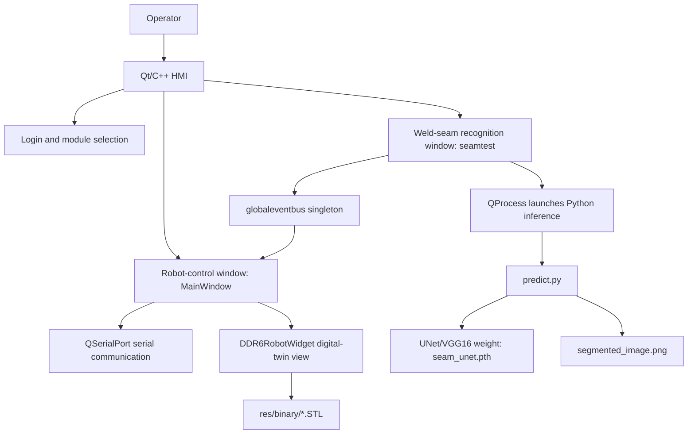
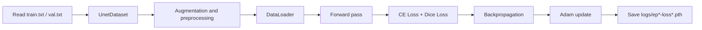
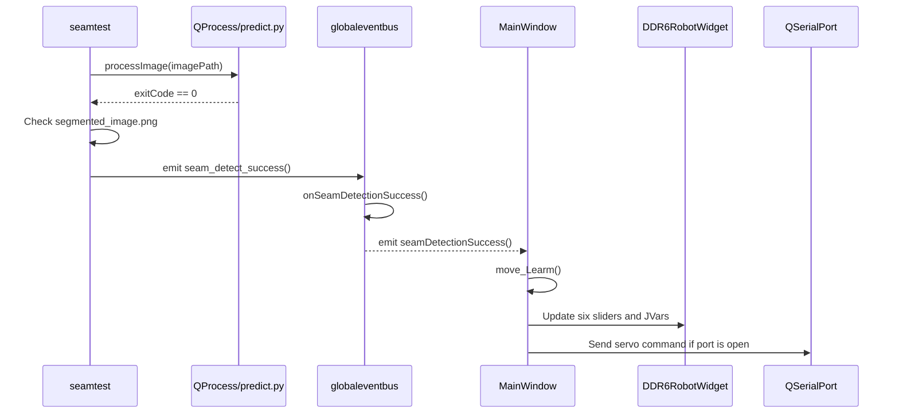



## TL;DR
- **Problem:** Weld-seam recognition demos need more than a segmentation model. Operators also need a desktop HMI, robot-control interaction, and a 3D view that makes motion and recognition results inspectable.
- **Method:** Built an **unofficial desktop HMI** for the **Hiwonder LeArm** platform with **Qt/C++**, Python segmentation inference, and **OpenGL** digital-twin rendering.
- **Result:** Integrated image selection, `predict.py` inference, result display, slider-driven joint control, and STL-based robot visualization. Resume-backed model work improved weld-seam segmentation accuracy from **64%** to **96.8%**.

## Open-Source Repository and Asset Boundaries

Project repository: [https://github.com/Bill-xing/HMI](https://github.com/Bill-xing/HMI)

The project code is open-source. The weld-seam dataset, trained model weights, and LeArm STL assets have separate distribution boundaries. This page keeps the engineering details from the README and the technical document, and all important figures have been moved into site static assets so the English page does not depend on local export paths.

## Project Overview

HMI is an unofficial desktop control application for the Hiwonder LeArm robotic arm platform. It is used for weld-seam recognition, UNet semantic segmentation inference, and slider-driven digital-twin joint-control demos. The Qt/OpenGL robot visualization work references [eagleqq/Robot3D](https://github.com/eagleqq/Robot3D), and the UNet training, prediction, and mIoU evaluation workflow references [bubbliiiing/unet-pytorch](https://github.com/bubbliiiing/unet-pytorch). This project adapts those ideas to LeArm, integrates the Qt HMI, launches Python inference from the desktop application, and validates the digital-twin control loop.

| Module | Key Content |
| --- | --- |
| Qt/C++ HMI | `logon`, `secinterface`, `mainwindow`, and `seamtest` UI and business logic |
| Recognition inference | `predict.py` is launched through `QProcess`; the default weight is `model_data/seam_unet.pth` |
| Dataset and training | Self-collected weld-seam dataset; `json_to_dataset.py` converts LabelMe JSON annotations into VOC masks |
| Digital twin | `DDR6RobotWidget` loads `base_link.STL` through `link_5.STL` and renders them with modified DH parameters |
| Runtime paths | `runtime_paths.cpp` centralizes project-root discovery, Python environment discovery, and output-path handling |
| Local configuration | `scripts/hmi_local_env.example.sh` is only a machine-local path template; real local config is ignored |

## Asset Boundaries

| Asset | Status |
| --- | --- |
| Repository code | Open-source at [Bill-xing/HMI](https://github.com/Bill-xing/HMI) |
| Weld-seam dataset | Self-collected and not committed to Git; documented as CC BY 4.0 |
| Self-trained UNet weight | Default filename `seam_unet.pth`; excluded from Git history and documented as Apache License 2.0 |
| LeArm STL model files | Not redistributed and no redistribution rights are granted; local demos require authorized STL files |
| Default login | Demo credentials are `username: admin` and `password: admin`; this is only for UI-flow demonstration |

## Demo Videos

| Weld-seam recognition | Independent joint slider control |
| --- | --- |
| [](https://youtu.be/_f371G87iBs?si=kt9yl1vsSmSuFXPl) | [](https://youtu.be/tFxSIknCsfQ?si=BHSCSx6OC0wbLYiz) |

Original videos:

- [Weld-seam recognition demo](https://youtu.be/_f371G87iBs?si=kt9yl1vsSmSuFXPl)
- [Independent joint slider control demo](https://youtu.be/tFxSIknCsfQ?si=BHSCSx6OC0wbLYiz)

## References and Licensing Boundaries

Third-party sources and notices are documented in `THIRD_PARTY_NOTICES`.

- [bubbliiiing/unet-pytorch](https://github.com/bubbliiiing/unet-pytorch): main reference for UNet training, prediction, and mIoU evaluation. The upstream project uses the MIT License.
- [eagleqq/Robot3D](https://github.com/eagleqq/Robot3D): main reference for Qt/OpenGL robot visualization, STL loading, and joint control.
- LeArm STL/structure model files: this repository only documents the adaptation and expected filenames; it does not provide STL files.
- Model weight: `model_data/seam_unet.pth` is trained for this project scenario and is not committed to Git by default.

The repository does not declare one unified license for all content. Before public release, code, STL resources, and third-party dependency license conditions should still be checked. The dataset and model-weight licenses are documented separately.

## Detailed Technical Architecture Notes

# Robot Digital-Twin HMI for Weld-Seam Recognition: Technical Document

## 1. Document Scope

This document is normalized from the thesis, the `HMI` source tree, and the supplementary implementation notes. It focuses on engineering implementation rather than restating the thesis text. The coverage includes weld-seam semantic segmentation, the Qt/C++ HMI, serial-port control, OpenGL digital-twin rendering, module coupling, runtime boundaries, and validation methods.

## 2. Overall Architecture

### 2.1 System Layers

The system is organized into four main layers:



| Layer | Main Components | Responsibility |
| --- | --- | --- |
| UI layer | `logon.ui`, `secinterface.ui`, `mainwindow.ui`, `seamtest.ui` | Login, module entry, image display, serial configuration, slider control |
| Business layer | `logon.cpp`, `secinterface.cpp`, `mainwindow.cpp`, `seamtest.cpp` | Flow scheduling, signal-slot wiring, serial command assembly, inference process management |
| Algorithm layer | `predict.py`, `unet.py`, `nets/`, `utils/`, `train.py` | Model training, inference, mIoU evaluation, data augmentation |
| Rendering layer | `rrglwidget.cpp`, `ddr6robotwidget.cpp`, `stlfileloader.cpp` | OpenGL initialization, binary STL parsing, robot joint transforms, interactive rendering |
| Runtime support | `runtime_paths.cpp`, `scripts/`, `docs/reproduction/` | Project-root discovery, Python environment lookup, output directory handling, packaging support |

### 2.2 Source Tree

Key files in `HMI`:

```text
HMI/
├── HMI.pro                         # Qt qmake project file
├── main.cpp                        # Application entry and --self-test entry
├── logon.*                         # Login window
├── secinterface.*                  # Secondary module-selection window
├── mainwindow.*                    # Robot control and serial communication window
├── seamtest.*                      # Weld-seam recognition window
├── globaleventbus.*                # Recognition-success event bus
├── runtime_paths.*                 # Runtime path, Python environment, and output path lookup
├── rrglwidget.*                    # Base OpenGL rendering widget
├── ddr6robotwidget.*               # LeArm digital-twin rendering widget
├── stlfileloader.*                 # STL file parsing and drawing
├── predict.py                      # Single-image inference entry
├── unet.py                         # Inference wrapper
├── train.py                        # Training script
├── get_miou.py                     # mIoU evaluation entry
├── json_to_dataset.py              # LabelMe JSON to segmentation dataset conversion
├── nets/                           # UNet/VGG16 network definitions
├── utils/                          # Dataloader, loss, training, and metric utilities
├── model_data/                     # Model-weight directory, default: seam_unet.pth
├── res/binary/                     # LeArm STL directory, not publicly redistributed
├── docs/                           # Dataset, weight, reproduction, and packaging notes
└── scripts/                        # Local environment and packaging scripts
```

### 2.3 Build and Dependency Model

The Qt project is managed by `HMI.pro`.

| Configuration | Content |
| --- | --- |
| Qt modules | `core`, `gui`, `widgets`, `serialport`, `opengl` |
| C++ standard | C++17 |
| Python integration | `PYTHON_HOME` and `PYTHON_VERSION` provide Python headers and library paths |
| macOS rpath | Points to `PYTHON_HOME/lib` and the bundled `Resources/python/lib` directory |
| Qt resources | `res.qrc`, including UI image resources |
| Source files | Control, recognition, event bus, runtime-path, OpenGL, and STL-loading files |

Python dependencies are recorded in `requirements.txt`.

| Dependency | Version | Purpose |
| --- | --- | --- |
| `torch` | 1.10.2 | Model training and inference |
| `torchvision` | 0.11.3 | Vision model and preprocessing ecosystem |
| `opencv-python` | 4.1.2.30 | Resize, color conversion, post-processing |
| `Pillow` | 8.3.1 | Image loading, saving, and blending |
| `numpy` | 1.19.2 | Array computation |
| `labelme` | 3.16.7 | Annotation data processing |
| `matplotlib` | 3.3.4 | Training curves and evaluation visualization |
| `tqdm` | 4.60.0 | Training progress bars |

## 3. Weld-Seam Semantic Segmentation

### 3.1 Technical Flow

The recognition module uses a U-Net style semantic segmentation pipeline. The complete process is: collect weld-seam images under multiple viewpoints and lighting conditions, annotate the seam region with LabelMe, convert JSON annotations into a VOC-style segmentation dataset, train a VGG-UNet model, evaluate mIoU, and call `predict.py` from the HMI for single-image inference.


Figure 2-1. U-Net semantic segmentation workflow.

### 3.2 Data Collection and Annotation

The weld-seam task uses pixel-level labels. Unlike object detection, which annotates rectangular boxes, semantic segmentation assigns a category to every pixel. The thesis workflow uses LabelMe polygons to outline weld-seam boundaries.


Figure 2-2. LabelMe annotation example.

The dataset is binary:

| Class Index | Class Name | Meaning |
| --- | --- | --- |
| 0 | `_background_` | Background |
| 1 | `seam` | Weld seam |

The public dataset notes record the following split:

| Split | Count |
| --- | ---: |
| train | 845 |
| val | 94 |
| trainval | 939 |
| test | 0 |

VOC-style layout:

```text
VOC2007/
├── JPEGImages/                 # Original images
├── SegmentationClass/          # Segmentation masks
└── ImageSets/
    └── Segmentation/
        ├── train.txt
        ├── val.txt
        └── trainval.txt
```

### 3.3 LabelMe JSON to VOC Masks

The conversion script is `json_to_dataset.py`. Its core logic:

1. Scan LabelMe JSON files under `datasets/before/`.
2. Read the source image from either the JSON `imageData` field or the `imagePath` field.
3. Use `labelme.utils.shapes_to_label` to rasterize polygon annotations into a pixel label matrix.
4. Build the class mapping: `_background_ -> 0`, `seam -> 1`.
5. Save the source image to `datasets/JPEGImages` and the mask to `datasets/SegmentationClass`.


Figure 2-3. Generated mask image.

Two implementation constraints matter:

- Masks must store class indices, not RGB colors. During training, `utils/dataloader.py` converts them into one-hot labels.
- Label resizing must use nearest-neighbor interpolation so continuous interpolation does not corrupt class indices.

### 3.4 Network Structure

#### 3.4.1 Base U-Net

U-Net consists of an encoder, a decoder, and skip connections. The encoder progressively downsamples features from local details to global semantics. The decoder upsamples them to recover spatial resolution. Skip connections concatenate encoder-side detail features with decoder-side semantic features, which improves edge recovery.


Figure 2-8. U-Net architecture.

#### 3.4.2 VGG-UNet

The final model uses `backbone = "vgg"`. Its encoder uses VGG16 to extract multi-scale features. The decoder uses `unetUp` modules to recover spatial resolution and concatenate same-scale encoder features. This structure works better than the initial U-Net variant for the small-sample weld-seam segmentation scenario.


Figure 2-10. VGG16 network structure.


Figure 2-11. VGG-UNet structure.

Implementation notes in `nets/unet.py`:

1. The `Unet` class switches between a VGG16 encoder and the original U-Net encoder through the `backbone` argument.
2. In VGG mode, the encoder outputs five feature levels: `feat1` through `feat5`.
3. The decoder executes `up_concat4`, `up_concat3`, `up_concat2`, and `up_concat1`.
4. The final layer generates two-class pixel logits: background and weld seam.

Execution order:

```text
up4 = up_concat4(feat4, feat5)
up3 = up_concat3(feat3, up4)
up2 = up_concat2(feat2, up3)
up1 = up_concat1(feat1, up2)
final = output_layer(up1)
```

The structure fits weld-seam boundary segmentation because pretrained VGG16 features improve convergence and generalization on a small dataset, U-Net skip connections preserve edge and texture detail, and binary output keeps the task focused on seam versus background.

### 3.5 Training Configuration

The training entry is `train.py`.

| Parameter | Current Value | Notes |
| --- | --- | --- |
| `Cuda` | `True` | Prefer GPU |
| `num_classes` | `2` | Background + weld seam |
| `backbone` | `"vgg"` | VGG16 encoder |
| `pretrained` | `True` | Initialize from pretrained weights |
| `model_path` | `model_data/seam_unet.pth` | Load or fine-tune an existing weight |
| `input_shape` | `[512, 512]` | Network input size |
| `Freeze_Epoch` | `50` | Freeze-stage training target |
| `Freeze_batch_size` | `2` | Freeze-stage batch size |
| `Freeze_lr` | `1e-4` | Freeze-stage learning rate |
| `UnFreeze_Epoch` | `100` | Unfreeze-stage training target |
| `Unfreeze_batch_size` | `2` | Unfreeze-stage batch size |
| `Unfreeze_lr` | `1e-5` | Unfreeze-stage learning rate |
| `dice_loss` | `True` | Use Dice Loss for small-object segmentation |
| `focal_loss` | `False` | Not enabled in the current configuration |
| `optimizer` | Adam | Adaptive optimizer |
| `lr_scheduler` | StepLR, gamma=0.96 | Learning-rate decay per epoch |
| `num_workers` | `4` | Dataloader worker count |

Training flow:



### 3.6 Augmentation and Preprocessing

`utils/dataloader.py` implements training augmentation in `get_random_data()`. Validation only performs aspect-ratio preserving resize and center padding.

| Augmentation | Implementation | Purpose |
| --- | --- | --- |
| Aspect-ratio jitter | `jitter=.3` with random target aspect ratio | Improve robustness to viewpoints and seam shapes |
| Random scale | `scale` from 0.25 to 2 | Improve scale robustness |
| Horizontal flip | 50% probability | Improve direction invariance |
| Random placement | Paste the resized image onto a 512x512 gray canvas | Simulate target position variation |
| HSV jitter | Random hue, saturation, and value shifts | Improve robustness under lighting variation |

Image preprocessing:

1. Use `cvtColor()` to ensure RGB input.
2. Use `resize_image()` to fit 512x512 while preserving aspect ratio; pad the rest with gray.
3. Apply `preprocess_input()` normalization.
4. Convert `HWC` to `CHW`, then add the batch dimension.

Label processing:

1. Resize masks with nearest-neighbor interpolation.
2. Map out-of-range pixels to `num_classes`.
3. Use `np.eye(num_classes + 1)` for one-hot labels used by Dice/F-score metrics.

### 3.7 Losses and Metrics

The default training loss is cross-entropy plus Dice Loss. Dice Loss is useful for small-object segmentation because the weld seam occupies a small image area.

```math
DiceLoss = 1 - \frac{2|X \cap Y|}{|X| + |Y|}
```

`X` is the predicted region and `Y` is the ground-truth annotation.

The evaluation metrics are pixel-level IoU, PA Recall, and Precision:

```math
PA\_Recall = \frac{TP}{TP + FN}
```

```math
Precision = \frac{TP}{TP + FP}
```

```math
IoU = \frac{TP}{TP + FP + FN}
```

| Symbol | Meaning |
| --- | --- |
| TP | Weld-seam pixels correctly recognized |
| FP | Background pixels wrongly predicted as weld seam |
| FN | Actual weld-seam pixels missed by the model |
| TN | Background pixels correctly excluded |


Figure 2-9. IoU diagram.

### 3.8 Optimization Results

The recorded optimization path has three main stages:

1. Switching from the original U-Net to VGG-UNet improved segmentation accuracy from about 64% to about 87%.
2. Adding VGG16 pretrained weights improved it from about 87% to about 89%.
3. Expanding the dataset from 30 images to 939 images reached about **96.8%** accuracy.

| VGG-UNet mIoU | Original U-Net mIoU |
| --- | --- |
|  |  |

Figures 2-12 and 2-13. Model-structure comparison.

| Without Pretraining | With Pretraining |
| --- | --- |
|  |  |

Figures 2-14 and 2-15. Pretraining comparison.

| 30-Image Dataset | 939-Image Dataset |
| --- | --- |
|  |  |

Figures 2-16 and 2-17. Dataset expansion comparison.

Before-and-after segmentation comparison:


Figure 2-18. Semantic segmentation comparison.

### 3.9 Inference Flow

The inference entry is `predict.py`, and the wrapper class is `Unet` in `unet.py`.

| Configuration | Default |
| --- | --- |
| `model_path` | `model_data/seam_unet.pth` |
| `num_classes` | 2 |
| `backbone` | `vgg` |
| `input_shape` | `[512, 512]` |
| `mix_type` | 1, blend original image and segmentation result |
| `cuda` | automatically determined |

The HMI calls the Python script through `QProcess`:

```text
seamtest::processImage(imagePath)
  -> QProcess starts predict.py
  -> predict.py loads Unet
  -> detect_image(image)
  -> save segmented_image.png
  -> seamtest reads and displays the result
```

The result displayed in the HMI:


Figure 2-19. HMI recognition result.

## 4. Qt/C++ HMI Control Module

### 4.1 From PyQt Prototype to C++ Qt

The project initially explored a PyQt-based prototype, but the final HMI was refactored into C++ Qt. The refactor has practical reasons:

1. Qt Designer UI files, C++ signal-slot wiring, and OpenGL widgets can be integrated directly.
2. `QSerialPort` provides convenient serial-port scanning and byte-array sending.
3. `QGLWidget` and legacy OpenGL immediate mode are easier to integrate with the Robot3D reference code.
4. qmake plus platform deployment tools can produce desktop application bundles.


Figure 3-2. Qt Designer interface layout.

### 4.2 Application Flow and Windows

`main.cpp` starts the `Secinterface` window in normal mode. The `--self-test` argument enters an automated smoke-test mode.

Main UI classes:

| Class | UI File | Responsibility |
| --- | --- | --- |
| `Logon` | `logon.ui` | Login and remember-password checkbox |
| `Secinterface` | `secinterface.ui` | Secondary module selection |
| `MainWindow` | `mainwindow.ui` | Serial communication, robot control, digital twin |
| `seamtest` | `seamtest.ui` | Image selection, inference process, result display |

Login logic:

- Default credentials: `username: admin`, `password: admin`.
- The remember-password checkbox is saved into `config.json`.
- A successful login emits the `login()` signal.
- `Secinterface` receives the signal and switches to the function-selection window.

Login and module-selection windows:


UI design drafts:

| Login UI Design | Module Selection UI Design |
| --- | --- |
|  |  |

### 4.3 Serial-Port Control Logic

`MainWindow` provides serial-port scanning, parameter configuration, opening/closing the port, manual HEX sending, slider control, and robot-digital-twin synchronization.


Control-window sections:

| Overview | Serial Settings | Joint Slider Area |
| --- | --- | --- |
|  |  |  |

Serial-port detection:


`MainWindow::detectPort()` refreshes available serial ports through `QSerialPortInfo::availablePorts()`. When a port is selected, baud rate, data bits, parity, stop bits, and flow control are configured before opening the port.

### 4.4 Servo Control Protocol

The LeArm servo-control area uses six sliders and six text boxes. Each slider updates the corresponding joint value, sends a serial command when the port is open, and updates the OpenGL digital-twin pose.

The command packet follows this pattern:

```text
55 55 len cmd servo_id low_byte high_byte time_low time_high
```

The implementation assembles a `QByteArray`, converts slider values into low/high bytes, and writes it through `serial->write(data)`.

### 4.5 Slider to Digital-Twin Joint Mapping

Slider values are not used as joint angles directly. They are first mapped into model-space joint variables.

Important observations from the implementation:

- Sliders use Hiwonder-style servo pulse values.
- `DDR6RobotWidget::setJ1()` through `setJ6()` update the six model joint variables.
- After each update, `updateGL()` refreshes the OpenGL view.
- The model offsets are tuned to match the STL coordinate frames and the robot's visual pose.

Signal-slot and slider-control diagrams:


### 4.6 Weld-Seam Window and Python Inference Integration

The `seamtest` window manages image selection and recognition.

Main flow:

1. The user selects an image.
2. The HMI displays the source image.
3. `QProcess` starts the Python inference script.
4. The HMI waits for process completion.
5. The HMI reads `segmented_image.png`.
6. The result is displayed in the right-side preview area.
7. If recognition succeeds, `seam_detect_success()` is emitted.

Using `QProcess` keeps Python inference isolated from the C++ UI. It also avoids embedding Python model code inside the Qt process, which would make packaging and dependency handling more fragile.

### 4.7 Runtime Path Management

`runtime_paths.cpp` prevents the application from relying on a fixed working directory. It resolves:

- Project root.
- Python executable.
- Python environment path.
- Inference output path.
- `segmented_image.png`.
- `config.json`.
- STL resource directory.

The lookup order is:

1. Use `HMI_PROJECT_ROOT` if it is set.
2. Otherwise infer the project root from the application path and known project files.
3. For Python, prefer `PYTHON_EXECUTABLE`, then derive from `PYTHON_HOME`, then fall back to `python`.
4. For outputs, prefer `HMI_OUTPUT_DIR`, then fall back to a writable runtime directory.

This design is important because Qt applications behave differently when run from the build directory, from a `.app` bundle, or from a packaged directory.

## 5. Digital-Twin Module

### 5.1 Robot Object and Modeling Goal

The digital-twin module aims to show the LeArm robot pose in the HMI and to let the user observe the effect of each slider-controlled joint. The model is not a physics simulator; it is a visual and kinematic representation for HMI feedback.

| Robot Model | DH Coordinate Frame |
| --- | --- |
|  |  |

### 5.2 Modified DH Parameters

The coordinate system uses a modified DH convention.


Figure 4-3. Modified DH coordinate frame.

Recorded dimensions:

```text
d1 = 95 mm
d2 = 9.5 mm
d3 = 104 mm
d4 = 88.47 mm
d5 = 59.28 mm
```

Modified DH table:

| i | a(i-1) | alpha(i-1) | d(i) | theta(i) |
| --- | ---: | ---: | ---: | ---: |
| 1 | 0 | 0 | d1 | 0 |
| 2 | d2 | -pi/2 | 0 | -pi/2 |
| 3 | d3 | 0 | 0 | 0 |
| 4 | d4 | 0 | 0 | -pi/2 |
| 5 | 0 | -pi/2 | d5 | -pi/2 |
| 6 | 0 | pi/2 | 0 | 0 |

`DDR6RobotWidget::configureModelParams()` uses rendering parameters:

```cpp
mRobotConfig.d     = {0, 95.0, 0.00, 0.00, 0.00, 59.28, 0.00};
mRobotConfig.JVars = {0, 0, 90, 0, -90, 0, 0};
mRobotConfig.a     = {0, 0, -9.8, 104, 88.47, 0, 0};
mRobotConfig.alpha = {0, 0, 90, 0, 0, -90, 0};
```

The leading element is a placeholder, and actual joints start at index 1. `a[2] = -9.8` corresponds to the small structural offset near the documented `d2 = 9.5 mm`, with sign and magnitude adjusted to align the STL coordinate frames.

### 5.3 Forward Kinematics

The single-step modified DH transform:

```math
^{i-1}T_i =
R_X(\alpha_{i-1})
D_X(a_{i-1})
R_Z(\theta_i)
D_Z(d_i)
```

Matrix form:

```math
^{i-1}T_i =
\begin{bmatrix}
\cos\theta_i & -\sin\theta_i & 0 & a_{i-1} \\
\sin\theta_i\cos\alpha_{i-1} & \cos\theta_i\cos\alpha_{i-1} & -\sin\alpha_{i-1} & -\sin\alpha_{i-1}d_i \\
\sin\theta_i\sin\alpha_{i-1} & \cos\theta_i\sin\alpha_{i-1} & \cos\alpha_{i-1} & \cos\alpha_{i-1}d_i \\
0 & 0 & 0 & 1
\end{bmatrix}
```

The full end-effector pose:

```math
^0T_i = ^0T_1 \cdot ^1T_2 \cdot \ldots \cdot ^{i-1}T_i
```

In OpenGL rendering, the code does not build an explicit matrix object. It applies the transforms in order:

```cpp
glTranslatef(a, 0.0, 0.0);
glRotatef(alpha, 1.0, 0.0, 0.0);
glTranslatef(0.0, 0.0, d);
glRotatef(theta, 0.0, 0.0, 1.0);
```

OpenGL's matrix stack performs the accumulated transforms implicitly, so each link is drawn relative to the previous link.

### 5.4 Inverse Kinematics and Verification

The thesis derives analytic expressions for `theta1` through `theta6` from the homogeneous transform matrix. The core idea:

1. Use the position terms to solve `theta1`.
2. Use orientation-matrix elements to eliminate variables and solve `theta5` and `theta6`.
3. Use the combined angle `theta234` for wrist orientation.
4. Use geometry to solve `theta2` and `theta3`.
5. Compute `theta4 = theta234 - theta2 - theta3`.

Because serial robot inverse kinematics can have multiple solutions, singularities, and unreachable poses, the notes record eight candidate solutions and some `NaN` entries. This is consistent with analytic IK for a six-axis serial arm.

Robotics Toolbox was used to cross-check forward and inverse kinematics:


Figure 4-4. Robotics Toolbox simulation.

Forward-kinematics test data:

| Input Joint Angles | End-Effector Pose Matrix |
| --- | --- |
| `[pi/4, -2*pi/3, -2*pi/3, 0, 2*pi/3, 0]` | `[[0.7891, -0.6124, 0.0474, -9.6593], [-0.4356, -0.6124, -0.6597, -9.6593], [0.4330, 0.5000, -0.7500, 15.0000], [0, 0, 0, 1.0000]]` |

The inverse-kinematics test shows that `T2` matches the preset `T0`, so the analytic inverse solution and the forward solution are consistent at the tested point.

### 5.5 STL Loading

Each robot link uses a binary STL file:

```text
res/binary/
├── base_link.STL
├── link_1.STL
├── link_2.STL
├── link_3.STL
├── link_4.STL
└── link_5.STL
```


Figure 4-5. Joint part.

`STLFileLoader::loadBinaryStl()` parses binary STL files:

| Byte Range | Content | Size |
| --- | --- | ---: |
| 0-79 | File header | 80 bytes |
| 80-83 | Triangle count `triangle_num` | 4 bytes |
| Each triangle | Normal vector + three vertices + attribute field | 50 bytes |

Single-triangle layout:

| Field | Content | Size |
| --- | --- | ---: |
| normal | 3 floats | 12 bytes |
| vertex 1 | 3 floats | 12 bytes |
| vertex 2 | 3 floats | 12 bytes |
| vertex 3 | 3 floats | 12 bytes |
| attribute | Attribute byte count | 2 bytes |

The theoretical file size is:

```math
FileSize = 84 + 50 \times N_{facet}
```

The code reads the file into memory and parses it with pointer offsets. This keeps the logic simple and fast for small LeArm demo models, although larger models would benefit from streaming or buffered parsing.

### 5.6 OpenGL Rendering Pipeline

`RRGLWidget` inherits from `QGLWidget`. Its responsibilities:

| Function | Purpose |
| --- | --- |
| `initializeGL()` | Configure lighting, depth testing, normal normalization, background color |
| `resizeGL()` | Set viewport and perspective projection |
| `paintGL()` | Overridden by subclasses for each-frame rendering |
| `drawGrid()` | Draw ground grid |
| `drawCoordinates()` | Draw world coordinate frame |
| `drawSTLCoordinates()` | Draw local STL coordinate frame |
| `setupColor()` | Configure material color |
| `mouseMoveEvent()` | Handle rotation, zoom, and pan |

`STLFileLoader::draw()` uses immediate-mode OpenGL:

```cpp
glBegin(GL_TRIANGLES);
for each triangle:
    glNormal3f(normal.x, normal.y, normal.z);
    glVertex3f(vertex0.x, vertex0.y, vertex0.z);
    glVertex3f(vertex1.x, vertex1.y, vertex1.z);
    glVertex3f(vertex2.x, vertex2.y, vertex2.z);
glEnd();
```

This is appropriate for learning and verification, but a larger or higher-frame-rate model should move to VBO/VAO rendering to reduce CPU-to-GPU submissions.

### 5.7 Joint-Level Rendering

`DDR6RobotWidget` inherits `RRGLWidget`. It loads every link STL and applies matrix transforms in joint order.

Initial view parameters:

```cpp
z_zoom = -500;
xRot = 30 * 16;
yRot = 45 * 16;
xTran = 0;
yTran = -200;
```

`paintGL()` clears color/depth buffers and applies the view transform:

```cpp
glTranslated(0, 0, z_zoom);
glTranslated(xTran, yTran, 0);
glRotated(xRot / 16.0, 1.0, 0.0, 0.0);
glRotated(yRot / 16.0, 0.0, 1.0, 0.0);
glRotated(zRot / 16.0, 0.0, 0.0, 1.0);
glRotated(+90.0, 1.0, 0.0, 0.0);
glRotated(180.0, 1.0, 0.0, 0.0);
drawGL();
```

`drawGL()` draws base, link1, link2, link3, link4, and link5 in order. Before each link is drawn, the corresponding DH translation and rotation are applied; later links inherit the transforms from earlier joints.

Digital-twin and physical states:

| HMI State 1 | Physical State 1 |
| --- | --- |
|  |  |

| HMI State 2 | Physical State 2 |
| --- | --- |
|  |  |

Figure 4-6. Digital-twin state compared with physical robot state.

### 5.8 Mouse Interaction

`RRGLWidget::mouseMoveEvent()` supports three interactions:

| Mouse Operation | Variable | Effect |
| --- | --- | --- |
| Left drag | `xRot`, `yRot` | Rotate view |
| Right drag | `z_zoom` | Zoom view |
| Middle drag | `xTran`, `yTran` | Pan view |

Qt stores rotation values as `angle * 16`, so rendering divides by 16.0 to recover degrees.

## 6. Module Coupling

### 6.1 From Recognition Success to Robot Motion

The recognition module and robot-control module are decoupled through `globaleventbus`.



`globaleventbus` is a QObject singleton:

```cpp
static globaleventbus* getInstance() {
    static globaleventbus instance;
    return &instance;
}
```

`seamtest` connects recognition success to the event bus:

```cpp
connect(this, SIGNAL(seam_detect_success()),
        globaleventbus::getInstance(),
        SLOT(onSeamDetectionSuccess()));
```

`MainWindow::initSerialPort()` listens to the global signal:

```cpp
connect(globaleventbus::getInstance(),
        SIGNAL(seamDetectionSuccess()),
        this,
        SLOT(move_Learm()));
```

This publisher-subscriber design avoids making `seamtest` hold a direct `MainWindow` pointer. The recognition window and control window can remain independent in lifecycle and display logic.

### 6.2 Preset Motion Pose

After successful recognition, `MainWindow::move_Learm()` sets six sliders to fixed values:

| Servo | Target Slider Value |
| --- | ---: |
| 1 | 1015 |
| 2 | 1162 |
| 3 | 1757 |
| 4 | 1647 |
| 5 | 1412 |
| 6 | 1640 |

Changing the sliders triggers the existing `valueChanged` chain, so the text boxes, digital-twin joint angles, and serial packets are all updated through the same path. `move_Learm()` does not need to call OpenGL refresh or serial sending directly.

## 7. Runtime Resource Boundaries

The page intentionally keeps resource and path boundaries instead of a command-style runbook. Local reproduction depends on Qt 5, a C++17 toolchain, a Python environment compatible with `requirements.txt`, the trained `model_data/seam_unet.pth` weight, a test weld-seam image, and authorized LeArm STL files. Machine-specific paths should be derived from `scripts/hmi_local_env.example.sh` and kept out of Git.

Key environment variables:

| Variable | Purpose |
| --- | --- |
| `HMI_PROJECT_ROOT` | Explicit HMI project root |
| `PYTHON_EXECUTABLE` | Python executable used by inference |
| `PYTHON_HOME` | Python/Conda environment root for Python C API and linker paths |
| `PYTHON_VERSION` | Python version, such as `3.9` |
| `HMI_OUTPUT_DIR` | Output directory for `segmented_image.png` and `config.json` |
| `HMI_TEST_IMAGE` | Input image for self-test mode |
| `HMI_INCLUDE_LOCAL_STL_ASSETS` | Whether private packages include local STL files |

`main.cpp` provides a `--self-test` mode. It checks:

1. Whether `predict.py` exists.
2. Whether `model_data/seam_unet.pth` exists.
3. Whether `HMI_TEST_IMAGE` is set and points to a file.
4. Whether the default `admin/admin` login emits the `login` signal.
5. Whether `MainWindow` can initialize.
6. Whether `seamtest::processImage()` can generate `segmented_image.png`.
7. Whether `seam_detect_success` is emitted.

Offscreen mode can limit OpenGL context behavior, so the self-test mainly verifies recognition and UI initialization, not full 3D rendering acceptance.

## 8. Validation and Quality Control

### 8.1 Algorithm Validation

| Validation Item | Method | Passing Standard |
| --- | --- | --- |
| Dataset completeness | Check `JPEGImages`, `SegmentationClass`, `ImageSets/Segmentation` | Every sample has an image and mask |
| Mask legality | Count mask pixel values | Only 0, 1, or ignored classes appear |
| Training runs | Run `train.py` | Training loop starts and saves weights |
| Inference runs | Run `predict.py image.jpg` | Non-empty `segmented_image.png` is generated |
| mIoU evaluation | Run `get_miou.py` | IoU, Recall, and Precision are reported |
| Robustness | Test bright, dark, and different-angle images | Main seam remains continuous and false positives are controlled |

### 8.2 HMI Validation

| Validation Item | Method | Passing Standard |
| --- | --- | --- |
| Login | Enter `admin/admin` | Secondary interface appears |
| Remember password | Enable checkbox and restart | `config.json` takes effect |
| Serial detection | Plug/unplug device and scan | Dropdown refreshes correctly |
| Open/close serial port | Select port and toggle | State changes correctly |
| HEX sending | Enter valid/invalid HEX | Valid packets send; invalid input prompts |
| Slider control | Drag six sliders | Text boxes, serial packets, and 3D model update together |
| Image recognition | Select weld-seam image | Source and result images display correctly |
| Recognition-to-motion link | Inference succeeds | Robot enters preset pose |

### 8.3 Digital-Twin Validation

| Validation Item | Method | Passing Standard |
| --- | --- | --- |
| STL loading | Open control window | All link models exist |
| Initial pose | Compare with physical robot or thesis figure | Visual pose is roughly consistent |
| Single-joint motion | Drag each slider separately | Corresponding joint moves in the expected direction |
| View rotation | Left drag | Model rotates |
| Zoom | Right drag | View distance changes |
| Pan | Middle drag | View center moves |
| Depth ordering | Observe from multiple angles | Front/back relationships are correct without severe mesh crossing |

## 9. Known Limits and Improvements

### 9.1 Current Limits

1. Weld-seam recognition remains a 2D pixel-level segmentation result and is not yet converted into real 3D coordinates.
2. After segmentation success, the robot moves to a fixed preset pose rather than planning a trajectory from seam geometry.
3. OpenGL rendering uses immediate mode (`glBegin/glEnd`), which is suitable for demonstration but not high-performance rendering.
4. Login is a demo-level local check, not a production authentication system.
5. The serial protocol mainly supports single-servo slider control; synchronized multi-servo control and checksums can be extended.
6. STL files are not publicly redistributed because of asset rights, so 3D reproduction requires authorized model files.
7. Python dependencies are old; migration to newer Python/PyTorch needs revalidation of training and inference.

### 9.2 Future Work

1. Add camera calibration and hand-eye calibration to map 2D segmentation into the robot coordinate frame.
2. Add seam centerline extraction, edge fitting, and grinding trajectory generation to the HMI.
3. Replace fixed-pose triggering with dynamic target points or trajectory sequences derived from recognition results.
4. Migrate STL rendering to VBO/VAO or a modern Qt OpenGL pipeline.
5. Add serial checksum, timeout retry, lower-controller state feedback, and error-state display.
6. Try lighter inference deployment through TorchScript, ONNX Runtime, or a C++ inference engine.
7. Add dataset versioning and experiment logs so model metrics remain traceable.

## 10. Source File Index

| Technical Point | Main Files | Notes |
| --- | --- | --- |
| Application entry and self-test | `main.cpp` | Normal startup uses `Secinterface`; self-test validates login, inference, and output |
| Login window | `logon.cpp`, `logon.h`, `logon.ui` | Default credentials and checkbox state persistence |
| Secondary interface | `secinterface.cpp`, `secinterface.h`, `secinterface.ui` | Entry points for control and recognition windows |
| Control window | `mainwindow.cpp`, `mainwindow.h`, `mainwindow.ui` | Serial detection, slider control, servo protocol, digital-twin coupling |
| Recognition window | `seamtest.cpp`, `seamtest.h`, `seamtest.ui` | Image selection, `QProcess` inference, result display |
| Event bus | `globaleventbus.h` | Recognition-success event relay |
| Path management | `runtime_paths.cpp`, `runtime_paths.h` | Project root, Python environment, and output directory lookup |
| OpenGL base widget | `rrglwidget.cpp`, `rrglwidget.h` | Lighting, projection, mouse interaction, base drawing |
| Robot digital twin | `ddr6robotwidget.cpp`, `ddr6robotwidget.h` | STL loading, DH parameters, joint-level rendering |
| STL parsing | `stlfileloader.cpp`, `stlfileloader.h` | Binary STL reading and triangle drawing |
| Inference entry | `predict.py` | Receives image path and saves `segmented_image.png` |
| Inference wrapper | `unet.py` | Loads `seam_unet.pth`, preprocesses, infers, and blends output |
| Network structure | `nets/unet.py`, `nets/vgg.py` | VGG-UNet and original U-Net structures |
| Training script | `train.py` | Freeze/unfreeze training, Adam, StepLR, weight saving |
| Dataloader | `utils/dataloader.py` | VOC reading, augmentation, one-hot labels |
| Training loop | `utils/utils_fit.py` | Training, validation, loss calculation, weight saving |
| Metrics | `get_miou.py`, `utils/utils_metrics.py` | mIoU, Recall, Precision |
| Annotation conversion | `json_to_dataset.py` | LabelMe JSON to VOC-style images and masks |
| Build configuration | `HMI.pro` | Qt modules, Python linking, sources, resources |
