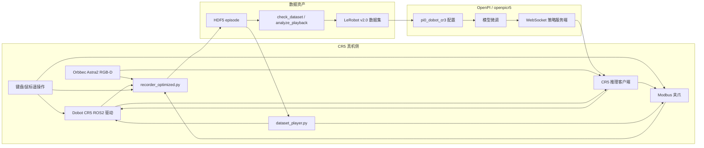
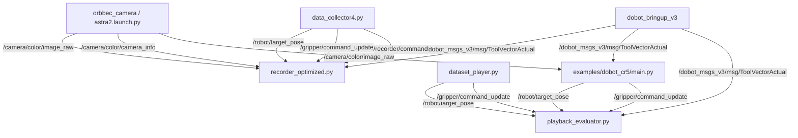
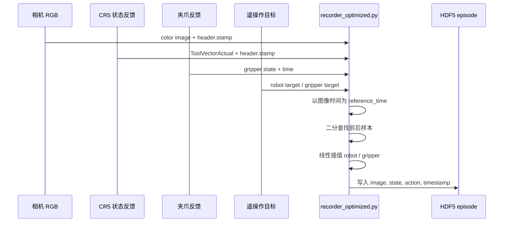
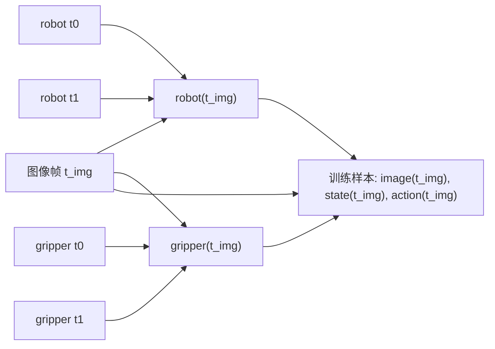
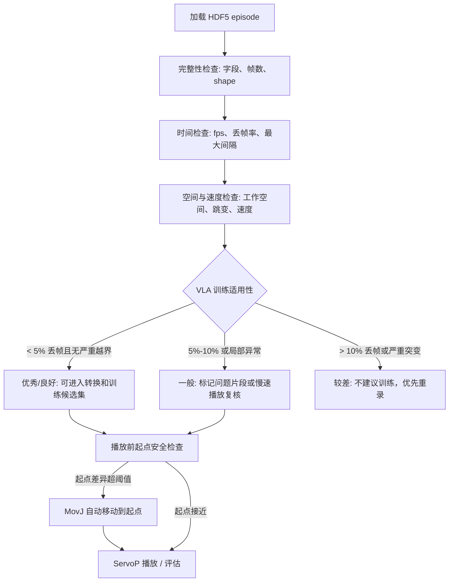
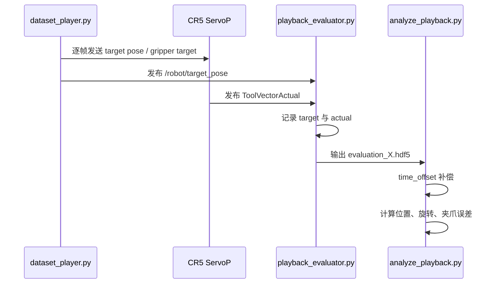
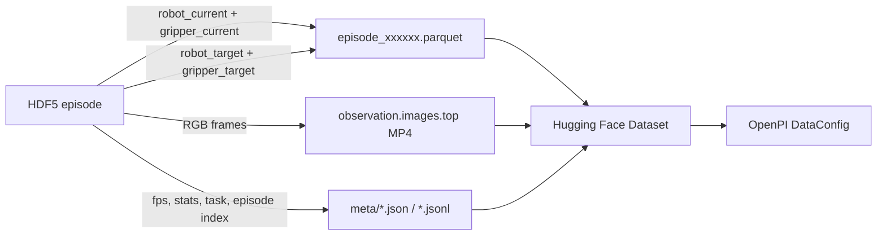
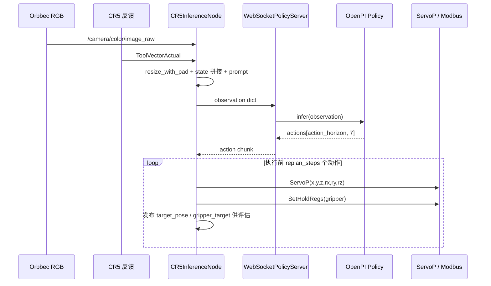
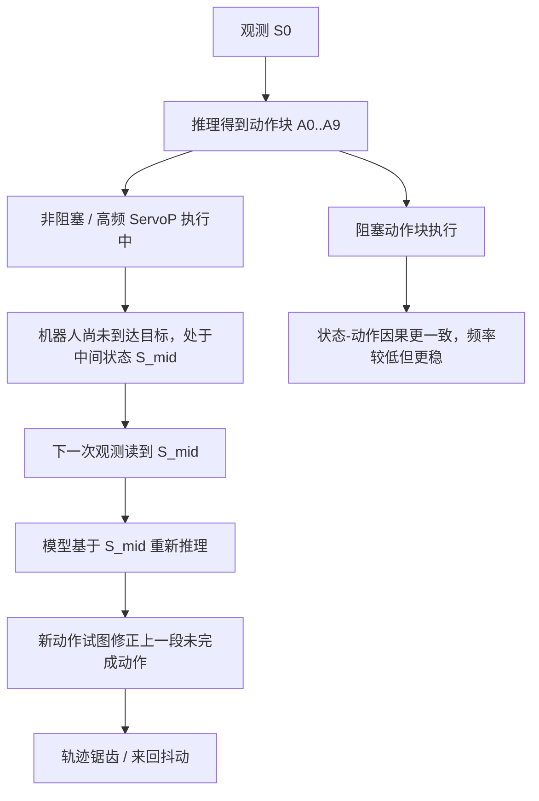



## 真机效果展示

| 叠毛巾任务 | 抓取任务 |
| --- | --- |
|  |  |

## 开源仓库

| 仓库 | 职责 |
| --- | --- |
| [openpicr5](https://github.com/Bill-xing/openpicr5) | OpenPI / VLA 适配、Dobot 策略映射、训练配置、WebSocket 策略服务和 CR5 推理客户端。 |
| [DOBOT_6Axis_ROS2_V3](https://github.com/Bill-xing/DOBOT_6Axis_ROS2_V3) | Dobot CR 系列 ROS2 驱动基础，以及真机数据采集、播放、转换和安全工具相关工作。 |
| [ros2_ws_xing](https://github.com/Bill-xing/ros2_ws_xing) | 优化版相机和录制启动脚本、Fast DDS 共享内存配置、高吞吐录制流程。 |

## 规范化技术报告

以下内容保留 CR5 真机适配报告的主体细节，包含分支事实、脚本职责、数据结构、安全检查、延迟分析、原始图片和工程结论。

# CR5 面向 VLA 的真机适配报告

## 0. 结论摘要

本项目围绕“越疆 Dobot CR5 + 奥比中光 Astra2 RGB-D 相机 + 电动夹爪”搭建了一个面向 VLA / OpenPI 的真机闭环。整体链路已经覆盖：

- ROS2 Humble 下的 CR5 驱动启动、ServoP 伺服控制、Modbus 夹爪控制。
- 奥比中光相机启动、RGB 图像获取、相机内参检查、相机数据吞吐优化。
- Eye-to-hand 手眼标定，最终以 `base_link -> camera_color_optical_frame` 静态 TF 发布。
- 键盘/鼠标遥操作与录制控制，遥操作侧发布机械臂目标、夹爪目标和录制指令。
- HDF5 数据采集，按相机帧为主时钟，将机械臂状态、夹爪状态插值到图像时间点。
- HDF5 到 LeRobot v2.0 数据集转换，输出 Parquet、MP4、`info.json`、`stats.json`、`episodes.jsonl`、`tasks.jsonl`。
- 数据播放、安全检查、播放误差评估、数据集质量检查。
- OpenPI / openpicr5 中的 Dobot 数据适配、`pi0_dobot_cr3` 训练配置、WebSocket 推理服务端、CR5 推理客户端。

需要实事求是说明的是：

1. 代码命名中大量使用 `cr3`，但笔记和任务目标是 CR5。这里应理解为历史命名遗留：OpenPI 配置名 `pi0_dobot_cr3`、策略文件 `dobot_cr3_policy.py`、转换脚本默认 `robot_type='dobot_cr3'` 并不等于硬件一定是 CR3。真机对象在笔记和推理客户端中明确为 CR5。
2. `DOBOT_6Axis_ROS2_V3` 当前 checkout 的 `main` 分支主要是官方/基础代码；大量真机数据采集、播放、评估、转换代码位于远端 `origin/server` 分支。
3. `openpicr5` 当前 `main` 分支已经保留 CR5 推理客户端和训练配置；`origin/read` 分支包含更激进的并行/独立进程、推理延迟分析、ServoP 延迟分析、预热等尝试；`origin/single` 分支体现了回退到单进程/串行执行路线的尝试。
4. 并行推理/独立 ServoP 进程的探索没有成为最终方案。实际结果显示，非阻塞或并行执行虽然能提高表面频率，但会让模型基于机器人尚未完成动作的中间状态继续推理，轨迹出现来回抖动；独立进程能部分降低 ServoP 调用时延，但队列同步和 DDS/控制器层面的瓶颈抵消了收益。
5. 当前最稳妥的真机推理方案不是“最高频率”，而是“动作块 + 阻塞 ServoP + 可解释的延迟统计 + 安全边界”。这是工程上更可靠的选择。

总体链路可以概括为：



## 2. 硬件、系统与基础 ROS2 环境

### 2.1 硬件组成

根据笔记，真机平台为：

- 机械臂：越疆 Dobot CR5。
- 相机：奥比中光 Astra2 RGB-D 相机。
- 夹爪：通过 Dobot 控制器的 Modbus RTU 接口控制，笔记中同时参考了 AG 系列和 DH 电爪资料。
- 主机：Ubuntu 22.04 + ROS2 Humble。
- 训练/推理服务器：OpenPI 环境，可本机或远端 GPU 服务器运行。

### 2.2 ROS2 基础包

机械臂侧主要依赖：

- `DOBOT_6Axis_ROS2_V3/dobot_bringup_v3`
- `DOBOT_6Axis_ROS2_V3/dobot_msgs_v3`
- `DOBOT_6Axis_ROS2_V3/cr5_moveit`
- `DOBOT_6Axis_ROS2_V3/dobot_demo`

相机侧依赖：

- `OrbbecSDK_ROS2/orbbec_camera`
- `OrbbecSDK_ROS2/orbbec_camera_msgs`
- `OrbbecSDK_ROS2/orbbec_description`

基础启动命令在 `examples/dobot_cr5/README.md` 中写为：

或手动设置 Fast DDS：

### 2.3 ROS 话题

笔记记录的相机 topic 包括：

```text
/camera/color/image_raw
/camera/color/camera_info
/camera/depth/image_raw
/camera/depth/camera_info
/camera/depth/points
/camera/ir/image_raw
/camera/ir/camera_info
/camera/gyro_accel/sample
/tf
/tf_static
```

VLA 采集和推理链路额外使用：

```text
/dobot_msgs_v3/msg/ToolVectorActual   # 机械臂当前末端位姿
/robot/target_pose                    # 遥操作/播放/推理发布的目标末端位姿
/gripper/command_update               # 夹爪目标
/gripper/state_feedback               # 夹爪实际反馈
/recorder/command                     # 录制控制：开始、保存、丢弃
```

其中 `ToolVectorActual` 后续被改造成带 header 时间戳的消息，这一点对相机与真机状态对齐非常关键。

ROS2 数据面和控制面的关系如下：



相机、RViz 与 MoveIt 部署记录：


## 3. 相机配置与手眼标定

### 3.1 相机型号和内参来源

笔记明确相机为奥比中光 Astra2。相机 SDK / ROS2 节点发布 `CameraInfo`，内参来自相机固件，而不是项目中手写的本地参数文件。

笔记中记录的 RGB 相机信息：

```text
frame_id: camera_color_optical_frame
height: 720
width: 1280
distortion_model: plumb_bob
D:
  0.11510352790355682
 -0.3182823061943054
 -0.0006209378479979932
  0.00015325525600928813
  0.24108868837356567
K:
  836.1256713867188, 0.0, 648.8511962890625
  0.0, 836.093505859375, 359.4328308105469
  0.0, 0.0, 1.0
```

在手眼标定阶段，项目关注三个参数：

- RGB 相机内参矩阵。
- IR 相机内参矩阵。
- RGB 与 IR / 深度之间的变换关系。

笔记中说明：Astra2 的 RGB 和 IR 都基于自己的坐标系，两个相机之间的关系可通过 `/tf` 获取；D2C 可以由硬件或软件完成。硬件 D2C 延迟低、CPU 负担小，但受固件参数和分辨率限制；软件 D2C 更灵活，但实时负载更高。

### 3.2 CameraInfo 畸变参数格式问题

MoveIt calibration 或其他 ROS 视觉工具常假设 `plumb_bob` 模型对应 5 个畸变参数，而奥比中光 `CameraInfo.d` 有时发布 8 个参数。笔记明确提到：

> 之前的坐标结算根本没有导入相机内参，原因是因为相机内参的格式和奥比中光发布的 camera_info 格式不一致。

为此写了 `fix_camera_info.py`。核心逻辑是：

```python
if msg.distortion_model == 'plumb_bob' and len(msg.d) != 5:
    msg.d = list(msg.d[:5])
```

这里有一个工程风险：输入和输出使用同名 topic 在 ROS2 中通常需要谨慎处理，避免同名订阅/发布造成混乱。更稳妥方式是让相机驱动发布到 raw topic，再由 fixer 发布标准 topic，例如：

```text
/camera/color/camera_info_raw -> /camera/color/camera_info
```

但笔记中实际命令是同名覆盖，报告中只能如实记录。

### 3.3 内参标定方法与精度判断

笔记中尝试过：

- ROS `camera_calibration`。
- MATLAB 标定工具。
- 使用标定板图片。
- 关闭 IR projector 后再拍摄，因为红外投射会在图像上造成很多光点，影响角点提取。

准确性评估标准使用重投影误差：

- 0.1 到 0.5 pixel：工业应用中比较优秀。
- 大于 1.0 pixel：不可信，建议重拍或检查模糊、反光、标定板质量。

笔记中对 MATLAB 标定的结论比较务实：MATLAB 可以剔除重投影误差高的数据后重新标定，但当前的主要瓶颈是标定板和拍摄条件。

### 3.4 Eye-to-hand 手眼标定

CR5 当前采用眼在手外（Eye-to-hand）配置。目标是得到：

```text
base_link -> camera_color_optical_frame
```

笔记中提到两类方法：

1. 早期近似方法：不用标定板，使用两个离得很近的点，通过最小二乘估计基座与相机坐标系关系。结论是“末端固定状态下问题不大”，但不是严格标定。
2. MoveIt calibration：RViz 插件，支持切换不同手眼算法，不需要手动获取标定板到 link6 的转换关系。

最终保存的 `camera_base.launch.py` 内容为：

```python
""" Static transform publisher acquired via MoveIt 2 hand-eye calibration """
""" EYE-TO-HAND: base_link -> camera_color_optical_frame """

Node(
    package="tf2_ros",
    executable="static_transform_publisher",
    output="log",
    arguments=[
        "--frame-id", "base_link",
        "--child-frame-id", "camera_color_optical_frame",
        "--x", "-0.777506",
        "--y", "-0.330606",
        "--z", "0.455513",
        "--qx", "-0.489589",
        "--qy", "0.703917",
        "--qz", "-0.421769",
        "--qw", "0.294811",
    ],
)
```

这里单位是 ROS TF 的米制平移，四元数表示姿态。该静态变换用于将相机坐标系下的点转换到机械臂基座坐标系，是后续视觉抓取、点云理解、VLA 图像/动作一致性的空间基础。

手眼标定的坐标链路如下：


手眼标定过程截图：


### 3.5 手眼标定当前结论

笔记中的最终表述是：

- MoveIt calibration 方法目前“感觉可以接受”。
- 但“目前还是有 bug，重投影误差太大”。
- 要提高精度，应从标定板和拍摄流程入手：
  - 放大标定图案。
  - 使用更高精度测量工具。
  - 选择更合适的标定位置。
  - 关闭 IR projector 或改善红外照明条件。

因此，报告不能把当前手眼标定写成“高精度完成”。更准确的结论是：当前有可用的静态 TF，可以支撑固定相机视角下的 VLA 数据采集和推理，但若要做基于深度点云的精确三维抓取，还需要重新做高质量标定和误差评估。

## 4. 遥操作与摇操代码

### 4.1 遥操作方案来源

笔记中参考了：

- Hugging Face LeRobot hardware integration。
- XLeRobot 的键盘遥操作示例。
- OpenTeleVision / Meta Quest3 的 VR 方案。

当前真正落地的主线是键盘/鼠标遥操作，VR 仍属于参考或探索方向。

`origin/server` 分支中相关文件包括：

- `dobot_demo/dobot_demo/data_collector4.py`
- `example/4_xlerobot_teleop_keyboard.py`
- `example/8_vr_teleop_with_dataset_recording.py`
- `example/dobot_teleop_refined.py`

### 4.2 `data_collector4.py` 架构

`data_collector4.py` 是遥操作和数据采集控制的核心脚本之一。它不是单纯的“键盘控制”，而是同时承担：

- 机械臂 ServoP 控制。
- 夹爪 Modbus 控制。
- 机械臂目标状态发布。
- 夹爪目标和反馈状态发布。
- 数据录制开始/保存/丢弃指令发布。

脚本中的 ROS 节点为：

```python
class DobotRosWrapper(Node):
    ...
```

它创建的服务客户端包括：

| 类别 | 服务接口 |
| --- | --- |
| 机器人使能与状态 | `EnableRobot`、`ClearError`、`SpeedFactor`、`Sync` |
| 运动控制 | `MovJ`、`MovL`、`ServoJ`、`ServoP` |
| 状态读取 | `GetPose`、`GetAngle` |
| 夹爪 Modbus | `ModbusCreate`、`ModbusClose`、`SetHoldRegs`、`GetHoldRegs` |

它发布：

```text
/robot/target_pose
/gripper/command_update
/gripper/state_feedback
/recorder/command
```

### 4.3 夹爪控制

夹爪通过 Dobot 控制器的 Modbus 接口控制：

- IP：`127.0.0.1`
- 端口：`60000`
- slave_id：`1`
- RTU 模式：`is_rtu = 1`

常用寄存器：

```text
256: Enable，使能寄存器
257: Force/Speed，力度/速度
259: Target position，目标位置
514: Current position，当前位置反馈
```

`GripperComm` 负责底层寄存器读写，`GripperManager` 作为独立线程负责：

- 鼠标按下期间按增量改变虚拟夹爪位置。
- 非阻塞写 Modbus 指令。
- 松开后读取实际位置，更新当前状态。
- 自动模式下由程序设置目标位置。

笔记中记录的一个实际问题是：夹爪真实读取频率较低，目标是 50Hz 或 100Hz，但实际 Modbus 回读常在 10Hz 左右。因此后续播放和采集代码中加入了线性插补，让低频夹爪反馈能以更高频率发布。

### 4.4 录制控制快捷键

`data_collector4.py` 中录制控制通过 `/recorder/command` 发布 `Int32`：

- `1`：开始录制。
- `2`：停止并保存。
- `0`：停止并丢弃。

笔记和代码中还体现了一个重要的安全/一致性改动：开始和结束录制时，机械臂先回到初始位置，再发布录制开始或保存指令。这能减少 episode 起止状态不一致，也减少播放时起点突变的风险。

## 5. 数据采集链路

### 5.1 采集目标

面向 VLA / OpenPI 的数据采集目标不是简单录视频，而是同步记录：

- 图像：相机 RGB 帧。
- 状态：机械臂实际末端 6D 位姿。
- 动作：遥操作/控制器发出的目标末端 6D 位姿。
- 夹爪状态：实际夹爪开度。
- 夹爪动作：目标夹爪开度。
- 时间戳：用于对齐每一帧。
- 相机内参：用于后续视觉几何或检查。

最终 HDF5 结构如下：

```text
observations/images/color      uint8, [N, H, W, 3]
observations/images/depth      可选, [N, H, W]
observations/robot_current     float32, [N, 6]
actions/robot_target           float32, [N, 6]
observations/gripper_current   float32, [N, 1]
actions/gripper_target         float32, [N, 1]
timestamp                      float64, [N]
camera/intrinsics              float32, [3, 3]
attrs:
  sim = False
  total_frames = N
  sync_method = FastBinarySearchInterpolation
  sync_strategy = async_processing_minimal_locking
  camera_frequency_hz = 30
  robot_frequency_hz = 100
  optimized = True
```

### 5.2 采集数据来源

录制器订阅：

```text
/recorder/command
/camera/color/camera_info
/camera/color/image_raw
/camera/depth/image_raw         # 可选
/dobot_msgs_v3/msg/ToolVectorActual
/robot/target_pose
/gripper/state_feedback
/gripper/command_update
```

机械臂状态一般由 Dobot 驱动反馈节点发布，目标状态由遥操作/播放/推理客户端主动镜像发布。这样数据集中可以同时保存“实际状态”和“动作命令”，避免只记录执行后的状态而丢掉监督学习的目标。

### 5.3 `recorder_optimized.py` 架构

`ros2_ws_xing/recorder_optimized.py` 的设计目标是解决原始采集中的丢帧和 CPU 负载问题。

优化点：

1. 回调函数只做轻量入队，不在 ROS 回调里做图像转换和 HDF5 写入。
2. 独立 processing thread 处理待录制帧。
3. 用 `deque(maxlen=...)` 保存短时间窗口内的有序消息。
4. 用二分查找对齐时间戳，避免线性扫描。
5. 对机械臂和夹爪状态做线性插值。
6. 默认不录深度图，因为深度图转换和压缩成本较高。
7. 保存 HDF5 时启用 gzip 压缩和 chunk。

关键缓冲配置：

```python
self.msg_buffer = {
    'color': deque(maxlen=60),
    'depth': deque(maxlen=60) if enable_depth else None,
    'robot_current': deque(maxlen=200),
    'robot_target': deque(maxlen=200),
    'gripper_current': deque(maxlen=200),
    'gripper_target': deque(maxlen=200),
}
```

以相机帧时间为 reference time：

```python
reference_time = color_msg.header.stamp
robot_current = interpolate(robot_current_buffer, reference_time)
robot_target = interpolate(robot_target_buffer, reference_time)
gripper_current = interpolate(gripper_current_buffer, reference_time)
gripper_target = interpolate(gripper_target_buffer, reference_time)
```

因此，数据集帧率等于实际保留下来的相机帧率。

采集时序可以理解为：



### 5.4 相机帧率与共享内存优化

笔记中记录了非常典型的问题：

- 目标相机帧率：30Hz。
- 启动控制和录制节点后，实际相机帧率掉到约 20Hz。
- 初始数据集丢帧率可达 27.15%，最大间隔可达 899.75ms，质量等级为差。

原始丢帧分析：

```text
实际帧数: 660
录制时长: 30.21 秒
期望帧数: 906
丢帧率: 27.15%
平均间隔: 45.84 ms
最大间隔: 899.75 ms
标准差: 73.11 ms
VLA训练适用性: 差，不建议使用
```

优化方式是 Fast DDS 共享内存：

相机启动时只开 RGB，关闭深度、IR、点云：

`camera_recorder_optimized.launch.py` 中对应参数：

```python
color_width = 640
color_height = 480
color_fps = 30
enable_depth = false
enable_ir = false
enable_point_cloud = false
```

共享内存优化后的笔记结果：

```text
实际帧数: 796
录制时长: 27.26 秒
期望帧数: 817
丢帧数量: 21
丢帧率: 2.57%
平均间隔: 34.29 ms
最大间隔: 99.98 ms
标准差: 6.29 ms
VLA训练适用性: 良好，可谨慎使用
```

另一个 episode：

```text
总帧数: 1125
总时长: 39.39 秒
平均帧率: 28.6 Hz
丢帧率: 4.74%
最大间隔: 199.97 ms
位置突变正常
旋转突变正常
夹爪变化正常
发现 3 个高速运动点
数据集基本可用，建议谨慎播放
```

结论：共享内存解决了主要的数据吞吐瓶颈，但并不能保证完全 0 丢帧。当前数据质量可以支持部分训练/验证，但高质量 VLA 训练仍建议进一步筛选 episode。

数据录制与播放总览图：


录制性能、同步代码与日志记录：


## 6. 相机与真机数据对时

### 6.1 为什么不能直接用同步器硬对齐

笔记中尝试过直接时间同步，但结论是：

> 直接使用时间对齐会丢很多图片，导致视频只有 20Hz，所以考虑采用线性拟合中间不满时间要求的点，实现不丢帧。

原因是各数据源频率不同：

- 相机：目标 30Hz，实际 25 到 30Hz 波动。
- 机械臂反馈：约 100Hz。
- 机械臂目标：由控制循环发布，可接近 100Hz。
- 夹爪目标：可较高频发布。
- 夹爪实际：Modbus 读取常约 10Hz。

如果使用严格 ApproximateTimeSynchronizer，任何一个低频源或抖动源没落在时间窗内，整帧图像都会被丢掉。这对 VLA 训练更糟，因为图像是核心观测。

### 6.2 当前对时策略

当前策略是：

1. 以相机 RGB 图像帧为基准。
2. 相机帧到达时记录其 `header.stamp`。
3. 对机器人状态和目标状态用二分查找找到前后两个样本。
4. 做线性插值。
5. 对夹爪状态也做线性插值。
6. 若必要数据缺失，则跳过该帧。

这样做的优点：

- 尽量保留图像帧。
- 让每个训练样本都拥有同一时间点的图像、状态、动作。
- 对高频机械臂数据来说插值误差较小。

缺点：

- 对夹爪真实反馈这类低频、非线性、带机械滞后的信号，线性插值只是近似。
- 如果相机时间戳本身不稳定，插值不能消除相机侧抖动。
- 对动作和状态之间的执行延迟没有自动建模，训练时仍可能学到“命令-到达”之间的 gap。

对齐策略的关键不是让所有消息同一时刻到达，而是以图像帧时间重采样其他信号：



### 6.3 ROS 时间选择

笔记特别强调 ROS2 时间：

- `RCL_SYSTEM_TIME`：墙上时间，可被 NTP 或手动改时影响。
- `RCL_STEADY_TIME`：单调时间，适合测耗时。
- `RCL_ROS_TIME`：ROS 时间，`use_sim_time=false` 时等同系统时间，仿真时跟随 `/clock`。

当前采集以 ROS 消息 header 时间戳为主，因此所有发布目标状态的节点必须使用同一套 ROS 时间来源。若一个节点使用系统时间、另一个节点使用仿真时间，数据会直接不可对齐。

### 6.4 推理时的对时尝试

`openpicr5 origin/read` 分支有“增加对时功能，获取同一时刻的动作与图像”的提交。后续又有“取消对时”的提交，说明严格对时在推理客户端中并未稳定保留。

这与数据采集结论一致：真机闭环中严格等待同一时刻数据会降低吞吐、放大延迟。最终更实用的策略是：

- 采集阶段以图像为主时钟，对状态插值。
- 推理阶段使用最新可用图像和最新可用 robot state 构建 observation。
- 对延迟做日志统计，而不是让控制链路阻塞等待完美同步。

## 7. 数据集质量与安全性校验

### 7.1 `check_dataset.py`

`origin/server` 中的 `check_dataset.py` 是综合检查工具，覆盖：

- 数据完整性。
- 丢帧率。
- 时间间隔统计。
- 工作空间限制。
- 位置/旋转/夹爪突变。
- 速度阈值。
- VLA 训练适用性评级。

默认安全阈值：

```python
MAX_POSITION_JUMP = 50.0    # mm
MAX_ROTATION_JUMP = 10.0    # deg
MAX_GRIPPER_JUMP = 200.0
MAX_VELOCITY = 100.0        # mm/s

WORKSPACE_X_MIN = -600.0
WORKSPACE_X_MAX = 600.0
WORKSPACE_Y_MIN = -600.0
WORKSPACE_Y_MAX = 600.0
WORKSPACE_Z_MIN = -100.0
WORKSPACE_Z_MAX = 600.0
```

丢帧评级：

- 丢帧率 < 1%：优秀，可直接用于 VLA 训练。
- 1% 到 5%：良好，建议检查分布，可谨慎使用。
- 5% 到 10%：一般，建议过滤严重片段或重新录制。
- > 10%：差，不建议使用。

质量与安全检查的决策链如下：



### 7.2 播放前安全检查

`dataset_player.py` 中新增了播放前安全检查。问题场景是：机械臂当前位置和数据集第一帧差距很大，如果直接 ServoP 到第一帧，机械臂可能突然大幅移动。

检查逻辑：

```python
position_threshold = 50.0  # mm
rotation_threshold = 10.0  # deg
pos_diff = norm(current_pose[:3] - target_pose[:3])
rot_diff = norm(current_pose[3:] - target_pose[3:])
```

如果超阈值，交互提供三个选项：

1. 自动移动到起始位置。
2. 取消播放，手动调整。
3. 忽略警告，强制播放。

自动移动使用 `MovJ`，不是 ServoP：

- 关节空间运动更适合起始位置迁移。
- 默认速度 50%。
- 30 秒超时。

其中 `--no-safety-check` 仅应在确认当前位置与起点非常接近时用于调试。

### 7.3 播放质量评估

播放质量评估由两个脚本构成：

- `playback_evaluator.py`：播放时录制目标状态和实际状态。
- `analyze_playback.py`：离线计算误差统计。

`playback_evaluator.py` 订阅：

```text
/robot/target_pose
/dobot_msgs_v3/msg/ToolVectorActual
/gripper/command_update
/gripper/state_feedback
```

输出：

```text
playback_eval/evaluation_X.hdf5
```

评估器支持时间偏移补偿：

```text
time_offset > 0 时：
目标位置查找 reference_time - time_offset
实际位置使用 reference_time
```

笔记中记录过 737ms 的时间偏移补偿，也记录了 `--time-offset 700` 的建议。这说明机械臂执行 ServoP 命令存在可观响应延迟，若不补偿，动态误差会混入稳态跟踪误差。

### 7.4 已观察到的播放误差

笔记中有两组代表性播放评估。

较短数据：

```text
总帧数: 160
总时长: 2.84 秒
平均频率: 56.3 Hz
时间偏移补偿: 737 ms

机械臂位置误差:
  平均值: 6.846 mm
  中位数: 0.053 mm
  最大值: 70.185 mm
  95%分位: 39.739 mm

旋转误差:
  平均值: 0.006 deg
  最大值: 0.021 deg

夹爪位置误差:
  平均值: 5.175
  最大值: 80.000

总体评级: 较差
```

较长数据：

```text
总帧数: 2037
总时长: 39.51 秒
平均频率: 51.6 Hz

机械臂位置误差:
  平均值: 10.161 mm
  中位数: 9.097 mm
  最大值: 100.087 mm
  95%分位: 21.467 mm

旋转误差:
  平均值: 0.012 deg
  最大值: 0.308 deg

夹爪位置误差:
  平均值: 13.531
  最大值: 160.000

总体评级: 较差
```

这说明当前播放链路可以完成重放，但位置跟踪误差仍不可忽略。旋转跟踪很好，位置误差主要集中在大跳变、起始阶段或 ServoP/控制器响应延迟上。

播放评估链路如下：



## 8. HDF5 到 LeRobot v2.0 格式转换

### 8.1 转换目标

OpenPI / LeRobot 训练不直接吃项目 HDF5，而是使用 LeRobot 数据集。`convert_to_lerobot.py` 参考 any4lerobot 格式，将 HDF5 转为 LeRobot v2.0：

```text
dataset/
├── data/
│   └── chunk-000/
│       ├── episode_000000.parquet
│       └── ...
├── videos/
│   └── observation.images.top/
│       └── chunk-000/
│           ├── episode_000000.mp4
│           └── ...
└── meta/
    ├── info.json
    ├── stats.json
    ├── episodes.jsonl
    └── tasks.jsonl
```

笔记中最终数据集发布地址：

```text
https://huggingface.co/datasets/leng234/cr5pickblock
```

### 8.2 字段映射

HDF5：

```text
observations/robot_current     [N, 6]
observations/gripper_current   [N, 1]
actions/robot_target           [N, 6]
actions/gripper_target         [N, 1]
observations/images/color      [N, H, W, 3]
timestamp                      [N]
```

LeRobot：

```text
observation.state = concat(robot_current, gripper_current)  # [N, 7]
action = concat(robot_target, gripper_target)               # [N, 7]
observation.images.top = MP4 video
timestamp = 原始时间戳
episode_index = episode 编号
frame_index = episode 内帧编号
index = 全局帧编号
task_index = 0
next.done = 只有最后一帧为 True
```

7 维状态/动作含义：

```text
0: x, mm
1: y, mm
2: z, mm
3: rx, deg
4: ry, deg
5: rz, deg
6: gripper, 0-1000 编码器/目标值
```

### 8.3 `info.json`

`info.json` 关键字段：

```json
{
  "codebase_version": "v2.0",
  "robot_type": "dobot_cr3",
  "fps": 30,
  "data_path": "data/chunk-{episode_chunk:03d}/episode_{episode_index:06d}.parquet",
  "video_path": "videos/{video_key}/chunk-{episode_chunk:03d}/episode_{episode_index:06d}.mp4",
  "features": {
    "observation.state": {
      "dtype": "float32",
      "shape": [7],
      "names": ["x", "y", "z", "rx", "ry", "rz", "gripper"]
    },
    "observation.images.top": {
      "dtype": "video",
      "shape": [3, 480, 640]
    },
    "action": {
      "dtype": "float32",
      "shape": [7],
      "names": ["x", "y", "z", "rx", "ry", "rz", "gripper"]
    }
  }
}
```

这里仍有 `dobot_cr3` 命名遗留。若要对外发布更规范，应改为 `dobot_cr5`，同时同步修改 OpenPI 数据配置名或至少在 README 中解释。

### 8.4 `stats.json`

`stats.json` 保存：

```text
observation.state:
  min/max/mean/std
action:
  min/max/mean/std
```

这些统计值用于：

- 模型训练归一化。
- 推理输出反归一化。
- 辅助安全检查，比如动作是否超出采集分布。

需要注意：`stats.json` 不能代替机械臂硬件限位。它只是数据分布统计；真正真机执行时仍应有工作空间限制、跳变限制、速度限制和急停机制。

### 8.5 LeRobot 版本问题

笔记中明确记录：

- 最新 LeRobot 对旧 v2.0 数据集兼容性不好。
- `lerobot-dataset-viz` 最新版本会出现 backward compatibility error。
- 最终使用 `lerobot==0.3.3` 的方式可视化 v2.0 数据。

这说明当前数据集格式与工具链版本绑定较强。长期维护建议之一是：固定转换工具的 LeRobot 版本，或升级到 LeRobot v3 同时同步修改 OpenPI 数据加载配置。

格式转换关系如下：



HDF5 转换为 LeRobot 数据集的检查截图：


## 9. OpenPI / openpicr5 适配

### 9.1 OpenPI 基本推理服务

OpenPI 原始支持通过 WebSocket 做远程推理：

服务端：

客户端通过 `openpi-client` 的：

```python
from openpi_client import websocket_client_policy
client = websocket_client_policy.WebsocketClientPolicy(host, port)
result = client.infer(observation)
actions = result["actions"]
```

这种架构把机器人的 ROS2 环境和模型的 GPU 环境分开，避免依赖冲突。

### 9.2 Dobot 数据输入适配

`openpicr5/src/openpi/policies/dobot_cr3_policy.py` 定义了输入/输出变换。

输入变换 `DobotCR3Inputs`：

- 读取 `observation/image`。
- 读取 `observation/state`。
- 将单相机图像映射到模型的 `base_0_rgb`。
- 左右腕部相机用零数组占位，并用 mask 置为 False。
- 透传 prompt。

核心结构：

```python
inputs = {
    "state": data["observation/state"],
    "image": {
        "base_0_rgb": base_image,
        "left_wrist_0_rgb": np.zeros_like(base_image),
        "right_wrist_0_rgb": np.zeros_like(base_image),
    },
    "image_mask": {
        "base_0_rgb": np.True_,
        "left_wrist_0_rgb": np.False_,
        "right_wrist_0_rgb": np.False_,
    },
}
```

输出变换 `DobotCR3Outputs`：

```python
return {"actions": np.asarray(data["actions"][:, :7])}
```

即模型动作被裁剪回 7D：

```text
x, y, z, rx, ry, rz, gripper
```

### 9.3 数据配置 `LeRobotDobotCR3DataConfig`

`openpicr5/src/openpi/training/config.py` 中定义了 Dobot 数据配置：

```python
class LeRobotDobotCR3DataConfig(DataConfigFactory):
    action_sequence_keys = ("action",)
```

repack 映射：

```python
{
    "observation/image": "observation.images.top",
    "observation/state": "observation.state",
    "actions": "action",
    "prompt": "prompt",
}
```

注意点：

- LeRobot 数据集动作字段是 `action`，OpenPI 内部通用键常用 `actions`，因此这里显式重命名。
- `prompt_from_task=True`，让模型从 `tasks.jsonl` 读取任务 prompt。
- 如果 `norm_stats` 缺失，代码默认设置为空字典以避免训练时报错。但训练严肃使用时应提供正确 norm stats。

### 9.4 训练配置 `pi0_dobot_cr3`

当前配置：

```python
TrainConfig(
    name="pi0_dobot_cr3",
    model=pi0_config.Pi0Config(
        pi05=True,
        action_horizon=10,
        discrete_state_input=False,
    ),
    data=LeRobotDobotCR3DataConfig(
        repo_id="/home/hit/openpi/my_data/my_data",
        base_config=DataConfig(prompt_from_task=True, video_backend="pyav"),
    ),
    batch_size=8,
    lr_schedule=CosineDecaySchedule(
        warmup_steps=10_000,
        peak_lr=5e-5,
        decay_steps=1_000_000,
        decay_lr=5e-5,
    ),
    optimizer=AdamW(clip_gradient_norm=1.0),
    ema_decay=0.999,
    weight_loader=CheckpointWeightLoader("gs://openpi-assets/checkpoints/pi05_base/params"),
    pytorch_weight_path="/home/hit/openpi/checkpoints/pi05_base_pytorch",
    num_train_steps=30_000,
)
```

以及模型权重拷贝：

### 9.5 Prompt 与任务描述

训练/推理中使用自然语言 prompt，例如：

```text
Pick up the red block and place it on the plate
pick up the red block
```

当前转换脚本中 `tasks.jsonl` 默认任务为：

```json
{
  "task_index": 0,
  "task": "robot_teleoperation",
  "task_description": "Teleoperation of Dobot CR3 robotic arm with gripper"
}
```

这与推理时具体 prompt 不完全一致。若训练数据实际任务都是“pick red block”等，应把 `tasks.jsonl` 改成真实任务描述，否则训练时语言条件和推理 prompt 有偏差。

## 10. 模型推理服务端

### 10.1 当前主线服务端

`scripts/serve_policy.py` 创建 policy 并启动：

```python
server = websocket_policy_server.WebsocketPolicyServer(
    policy=policy,
    host=host,
    port=port,
    metadata=metadata,
)
server.serve_forever()
```

服务端默认监听 `0.0.0.0:8000`，客户端通过 WebSocket 发送 observation dict，服务端返回 action chunk。

### 10.2 `origin/read` 的服务端预热

`origin/read` 修改了 `src/openpi/serving/websocket_policy_server.py`，在 `serve_forever()` 前加入：

```python
self.warmup()
asyncio.run(self.run())
```

预热输入：

```python
dummy_obs = {
    "observation/image": np.zeros((224, 224, 3), dtype=np.uint8),
    "observation/wrist_image": np.zeros((224, 224, 3), dtype=np.uint8),
    "observation/state": np.zeros(7, dtype=np.float32),
    "prompt": "warmup",
}
```

目的：

- 触发模型第一次编译/缓存。
- 完成 PyTorch/Triton autotune。
- 避免真机第一步推理阻塞过长。

同一分支还在返回结果中增加：

```python
action["server_timing"] = {
    "infer_ms": infer_time * 1000,
}
```

这对定位“客户端阻塞来自网络还是模型推理”很有价值。

当前 `main` 是否保留 warmup 需要以分支代码为准。已观察到 `main` 里 `websocket_policy_server.py` 没有这些调试增强，说明 warmup 属于 `origin/read` 尝试分支，不是稳定主线。

推理服务端与客户端的数据交换如下：



## 11. 模型推理客户端

### 11.1 当前 `examples/dobot_cr5/main.py`

当前主线的 CR5 推理客户端文件：

```text
openpicr5/examples/dobot_cr5/main.py
```

功能：

- 连接 WebSocket 策略服务器。
- 订阅 RGB 图像 `/camera/color/image_raw`。
- 订阅机械臂当前位姿 `/dobot_msgs_v3/msg/ToolVectorActual`。
- 构建 OpenPI observation。
- 以 action chunk + replan 的方式获取动作。
- 使用 ServoP 控制机械臂。
- 使用 Modbus 控制夹爪。
- 发布 `/robot/target_pose`、`/gripper/command_update`、`/gripper/state_feedback`，保持与采集/评估链路兼容。

或 tyro 风格：

### 11.2 客户端参数

```python
host: localhost
port: 8000
resize_size: 224
replan_steps: 5
prompt: "pick up the object"
max_steps: 3000
dry_run: False
```

其中：

- `resize_size=224` 与 OpenPI 模型输入一致。
- `replan_steps=5` 表示每次模型返回 10 步动作，但只执行前 5 步后重新推理。
- `dry_run=True` 可用于不控制机械臂，只验证流程。

### 11.3 Observation 构建

当前客户端构建：

```python
img = cv2.cvtColor(cv_image, cv2.COLOR_BGR2RGB)
img = image_tools.resize_with_pad(img, 224, 224)
img = image_tools.convert_to_uint8(img)

gripper_normalized = current_pos / 1000.0
state = [x, y, z, rx, ry, rz, gripper_normalized]

obs = {
    "observation/image": img,
    "observation/wrist_image": img,
    "observation/state": state,
    "prompt": prompt,
}
```

注意：当前没有腕部相机，`observation/wrist_image` 复用主相机。训练侧 `DobotCR3Inputs` 对腕部图像使用 mask=False 的零图占位，而当前推理客户端传的是主相机复用图。这个差异需要关注：

- 如果服务端 data transform 会把 `observation/wrist_image` 忽略，则影响不大。
- 如果模型实际读取了该字段，训练/推理分布会不一致。

更稳妥做法是：推理客户端也与训练 transform 一致，将腕部图像置零并显式 mask 掉，或者训练时也复用主相机。当前报告只能指出此处存在潜在不一致。

### 11.4 Action 执行

模型输出：

```text
actions: [action_horizon, 7]
action = [x, y, z, rx, ry, rz, gripper]
```

当前代码假设模型输出已经反归一化：

```python
target_pose = action[:6]
gripper_raw = action[6]
gripper_target = clip(gripper_raw, 0, 1000)
```

机械臂控制：

```python
ServoP(x, y, z, rx, ry, rz)
```

夹爪控制：

```python
SetHoldRegs(addr=259, value=gripper_target)
```

### 11.5 动作队列与重规划

客户端不会每一帧都调用模型。逻辑是：

1. 队列为空时调用 `policy_client.infer(obs)`。
2. 模型返回 10 个动作。
3. 只把前 `replan_steps` 个动作加入队列。
4. 每次循环弹出一个动作执行。
5. 队列空了再推理。

这避免了每帧推理造成的延迟，也避免长动作 chunk 执行过久导致闭环不及时。

### 11.6 推理日志事实

笔记中记录的一段实际推理日志：

```text
First inference elapsed=81.8ms
后续 inference 多在 58-68ms
ServoP 有时 3-6ms，有时 50-66ms
Step 30 动作频率 25.2Hz，去推理后 38.4Hz
Step 60 动作频率 25.9Hz，去推理后 39.1Hz
Step 150 动作频率 20.8Hz，去推理后 28.3Hz
```

结论：

- 模型推理本身约 60ms。
- ServoP 耗时不稳定。
- 即使目标是 30Hz，实际动作频率会受推理、ServoP 和队列阻塞影响。
- 强行 sleep 到 1/30 秒不一定提升效果，笔记中写明加 sleep 后频率反而降到约 26Hz。

推理客户端日志与 timing 记录：


## 12. 并行推理与独立进程尝试：为什么失败或未采用

### 12.1 问题背景

数据采集/播放中的 ServoP 调用可以达到较低延迟：

```text
data_collector4.py 中 ServoP:
Avg: 11.86ms
Min: 2.36ms
Max: 58.40ms
```

但 VLA 推理客户端中，同样的 ServoP 有时达到：

```text
90-100ms
```

这导致实际控制频率只能到约 10Hz 或 20Hz，低于目标 30Hz。

### 12.2 尝试 1：MultiThreadedExecutor + 回调组分离

思路：

- 将 ServoP 服务、图像订阅、状态订阅放入不同 callback group。
- 使用多线程 executor。

结果：

- 无明显改善。
- ServoP 仍约 100ms。

原因判断：

- callback group 只影响 Python 回调调度。
- ServoP 延迟主要不是 Python 回调互斥导致，而可能来自 DDS、Dobot 控制器响应、图像数据流干扰、服务调用频率等。

### 12.3 尝试 2：ServoNode 独立节点

思路：

- 单独创建一个只包含 ServoP client 的 ROS 节点。
- 避免图像订阅和状态订阅影响 ServoP client。

结果：

- 仍约 90-100ms。

原因判断：

- 虽然节点独立，但还在同一 Python 进程、同一 rclpy 上下文和同一网络/DDS环境中。

### 12.4 尝试 3：不同服务等待方式

尝试：

- `rclpy.spin_until_future_complete`
- 手动轮询：

```python
while not future.done():
    time.sleep(0.001)
```

结果：

- 两种方式延迟相似。

说明问题不主要在 future 等待 API。

### 12.5 尝试 4：ServoPThread 高频发送线程

思路：

- 独立线程持续高频发送 ServoP。
- 主推理循环只更新目标位姿，不等待 ServoP。

结果：

- 表面频率可提升。
- 但轨迹出现严重锯齿、波峰波谷和来回晃动。

关键原因：

- VLA 推理是闭环的。
- 上一次推理返回的 5 步动作还没执行完，下一次推理已经读到了“运动中的中间状态”。
- 模型基于中间状态预测下一段动作，可能需要往回修正，导致轨迹来回抖。

笔记中明确对比：

- dataset_player 非阻塞能跑，是因为它不重新推理，只顺序执行固定轨迹。
- VLA 推理非阻塞会抖，是因为动作执行和下一次 observation 之间存在闭环耦合。

### 12.6 尝试 5：独立进程 multiprocessing

思路：

- 将 ServoP 放到完全独立 Python 进程。
- 独立 `rclpy.init()`。
- 通过 multiprocessing queue 传目标位姿。

`origin/read` 中有：

```python
def servo_process_worker(cmd_queue, result_queue, stop_event):
    rclpy.init()
    node = rclpy.create_node("servo_process_node")
    ...
```

结果：

```text
独立进程 ServoP 延迟: 约 48ms
主进程等待时间: 约 85ms
控制频率仍约 10Hz
```

改善有限，原因：

- 进程内 ServoP 降低了部分延迟。
- 但主进程到 servo 进程的队列同步开销、等待结果开销、以及控制器响应延迟仍在。
- 图像订阅的大数据流和 DDS 层资源竞争可能仍影响整体系统。

### 12.7 尝试 6：独立进程 + 高频持续发送

思路：

- 即使没有新命令，也持续发送当前 pose。
- 让 Dobot 控制器保持“连续伺服模式”。

观察：

- 延迟约 48ms，仍未达到 data_collector 的 11ms。
- 轨迹质量不如阻塞方式稳定。

### 12.8 最终工程结论

`SERVO_LATENCY_INVESTIGATION.md` 的结论可以概括为：

1. 无法在 VLA 推理客户端稳定复现 `data_collector4.py` 的 11ms ServoP 延迟。
2. Dobot 控制器可能和指令发送频率有关，高频持续 ServoP 更快。
3. 图像订阅和推理会改变系统资源状态。
4. 非阻塞虽然频率高，但轨迹质量差。
5. 独立进程能部分降低 ServoP 调用时延，但总闭环收益不足。
6. 当前最可用方案是阻塞执行或较串行的动作块执行，接受较低控制频率，优先保证轨迹质量和任务完成。

这就是“并行推理尝试失败”的真实原因：失败不是代码完全跑不起来，而是并行化破坏了 VLA 闭环控制中的状态-动作一致性，且系统瓶颈不只在 Python 线程。

并行尝试的失败模式可以画成：



## 13. 数据播放

### 13.1 `dataset_player.py`

`dataset_player.py` 用于重放 HDF5 轨迹，核心功能：

- 加载 `actions/robot_target`。
- 加载 `actions/gripper_target`。
- 按 `timestamp` 的实际间隔播放。
- 使用 ServoP 控制机械臂。
- 用 Modbus 控制夹爪。
- 发布目标状态话题给评估器。
- 播放前做安全检查。

播放循环：

```text
for each frame:
  robot_pose = robot_target[i]
  gripper_pos = gripper_target[i]
  ServoP(robot_pose)
  set_gripper(gripper_pos)
  publish_robot_target(robot_pose)
  sleep(next_timestamp - current_timestamp - elapsed_loop)
```

### 13.2 播放频率

播放不强行固定 100Hz，而是读取原始 `timestamp`：

```python
time_diffs = np.diff(self.timestamps)
target_dt = time_diffs[i] / playback_rate
```

这比固定 sleep 更能保留录制时的节奏，也能用于慢放：

### 13.3 夹爪状态插补

`dataset_player.py` 中有 `GripperStateFeedback` 线程：

- 以约 10Hz 读取 Modbus 实际位置。
- 以更高频率发布插补后的夹爪实际状态和目标状态。

原因是夹爪 Modbus 回读慢，而评估和录制希望有更平滑的高频状态。

## 14. 模型微调流程

### 14.1 数据准备

完整数据准备流程：

1. 启动 Dobot 驱动。
2. 启动相机，建议启用 Fast DDS 共享内存，只开 RGB 640x480@30。
3. 启动 `recorder_optimized.py`。
4. 启动 `data_collector4.py` 做遥操作。
5. 通过遥操作按键发布 `/recorder/command=1` 开始录制。
6. 完成任务后发布 `/recorder/command=2` 保存。
7. 用 `check_dataset.py` 检查质量。
8. 用 `dataset_player.py` 慢速播放验证安全性。
9. 用 `playback_evaluator.py` + `analyze_playback.py` 检查重放误差。
10. 用 `convert_to_lerobot.py` 转为 LeRobot v2.0。
11. 用 LeRobot 可视化工具检查视频、状态、动作是否匹配。

微调准备流程如下：


### 14.2 训练数据字段一致性

训练中最重要的是确保以下一致：

| 项目 | 采集 | 转换后 | OpenPI 输入 |
| --- | --- | --- | --- |
| 图像 | `observations/images/color` BGR/RGB 存储 | `observation.images.top` MP4 | `observation/image` -> `base_0_rgb` |
| 状态 | robot_current + gripper_current | `observation.state` 7D | `state` 7D |
| 动作 | robot_target + gripper_target | `action` 7D | `actions` 7D |
| 文字 | 任务描述 | `tasks.jsonl` | `prompt` |

### 14.4 当前微调风险

当前微调存在几个必须注意的问题：

1. **命名不一致**：CR5 数据使用 `cr3` 名称，容易误导后续维护者。
2. **prompt 过泛化**：转换脚本默认任务是 `robot_teleoperation`，而推理 prompt 是具体任务。训练数据 prompt 应更接近真实任务。
3. **腕部图像不一致**：训练 transform 使用零腕部图像 + mask false；推理客户端复用主图像到 wrist image。
4. **action/state gap**：笔记中提到“控制信号 action 和实际可达 state 存在 gap”。若动作标签是 target 而状态是 actual，模型学到的是命令空间；推理时输出命令是否能到达取决于 ServoP 和控制器响应。
5. **数据质量波动**：部分 episode 丢帧率 2.57%-4.74% 尚可，早期 27.15% 不建议训练。
6. **夹爪信号低频**：夹爪真实反馈经插补，不能过度解释为真实高频测量。

## 16. 当前系统主要问题

### 16.1 数据质量

共享内存前的数据丢帧率太高，不建议用于训练。共享内存后数据明显改善，但仍需逐 episode 检查：

- 丢帧率。
- 最大时间间隔。
- 起止位置。
- 是否存在突变。
- 是否有高速运动点。

### 16.2 手眼标定精度

当前静态 TF 可用，但笔记中仍承认重投影误差和标定板条件问题。若后续任务只依赖 RGB 图像和端到端策略，影响有限；若要用深度点云做动作先验或抓取点计算，则必须重新标定。

### 16.3 推理闭环频率

当前难点不是“能不能调用模型”，而是：

- 模型推理约 60ms。
- ServoP 时延不稳定。
- 非阻塞会造成轨迹抖动。
- 并行进程改善有限。

因此短期策略是接受较低控制频率，保证闭环 observation/action 的一致性。

### 16.4 动作标签语义

数据集中 `action` 是目标位姿，不是实际到达位姿。模型学到的是“应发送给控制器的命令”，不是“下一时刻实际状态”。这在 ServoP 延迟和控制器跟踪误差存在时，会影响推理效果。

可选方向：

- 保持现状，让模型学习命令空间。
- 把 action 改为延迟补偿后的实际可达状态。
- 训练时加入 action/state gap 的补偿。
- 用播放评估中估计的时间偏移修正标签。

当前代码没有系统性完成该补偿。

### 16.5 腕部图像字段

训练和推理对腕部图像处理不完全一致，建议统一。

### 16.6 命名混乱

CR5 真机适配中存在 `cr3` 命名遗留。短期不影响运行，长期会影响协作、报告和复现实验。

## 17. 建议的下一步

### 17.1 短期

1. 固定当前稳定链路：
   - Fast DDS 共享内存。
   - RGB 640x480@30。
   - `recorder_optimized.py`。
   - `check_dataset.py`。
   - `convert_to_lerobot.py`。
   - 阻塞/串行推理客户端。

2. 清理命名：
   - `pi0_dobot_cr3` 可暂时保留，但在 README 明确“该配置用于 CR5，cr3 是历史命名”。
   - 新增 `pi0_dobot_cr5` alias 或正式配置。

3. 统一腕部图像：
   - 若没有腕部相机，推理也用零图 + mask false。
   - 或训练时明确复用 top image。

4. 每个 episode 入库前必须跑：

### 17.2 中期

1. 重新做手眼标定：
   - 标定板固定、尺寸准确。
   - 关闭 IR projector 或控制红外照明。
   - 输出重投影误差。
   - 保存每次标定的 session 和最终 TF。

2. 数据标签补偿：
   - 根据播放评估得到的时间偏移，把 action 与未来 actual state 对齐。
   - 比较“命令空间 action”和“可达状态 action”的训练效果。

3. 服务端 warmup 合入主线：
   - 将 `origin/read` 的 warmup 和 `server_timing` 以可选参数方式合入，而不是只留在实验分支。

4. 推理客户端日志标准化：
   - 保存 infer_ms、servo_ms、gripper_ms、image_age_ms、state_age_ms。
   - 每次运行生成 hdf5/csv 日志，便于对比。

### 17.3 长期

1. 考虑 C++ ServoP 控制节点：
   - Python/rclpy 对高频控制不是最理想。
   - 可把控制执行层移到 C++，Python 只负责模型推理和目标下发。

2. 明确实时控制接口：
   - 研究 Dobot 控制器是否存在更适合连续伺服的接口或参数。
   - 若 ServoP 服务调用本身不稳定，模型侧优化意义有限。

3. 引入更可靠的数据格式版本：
   - 迁移 LeRobot v3。
   - 或固定 v2.0 工具链，写清依赖版本。

4. 增加多任务数据：
   - 当前看起来主要是 pick block。
   - VLA 微调需要更丰富动作、物体、场景和语言。

## 18. 文件索引

### 真机笔记

```text
真机笔记/二、真机部署 ...md
真机笔记/二、真机部署/手眼标定 ...md
真机笔记/二、真机部署/数据录制与播放 ...md
真机笔记/二、真机部署/数据录制与播放/代码修改 ...md
真机笔记/二、真机部署/hdf5到lerobot v2 0格式转换 ...md
真机笔记/二、真机部署/openpi环境部署 ...md
真机笔记/二、真机部署/推理客户端部署 ...md
真机笔记/二、真机部署/bug维修记录 ...md
```

### `openpicr5`

```text
examples/dobot_cr5/main.py
examples/dobot_cr5/README.md
examples/dobot_cr5/DESIGN.md
src/openpi/policies/dobot_cr3_policy.py
src/openpi/training/config.py
scripts/serve_policy.py
src/openpi/serving/websocket_policy_server.py
packages/openpi-client/src/openpi_client/websocket_client_policy.py
```

实验分支 `origin/read` 额外包括：

```text
examples/dobot_cr5/SERVO_LATENCY_INVESTIGATION.md
examples/dobot_cr5/analyze_inference_log.py
examples/dobot_cr5/run_and_analyze.py
```

### `DOBOT_6Axis_ROS2_V3 origin/server`

```text
dobot_demo/dobot_demo/data_collector4.py
dobot_demo/dobot_demo/recorder_optimized.py
dobot_demo/dobot_demo/dataset_player.py
dobot_demo/dobot_demo/playback_evaluator.py
dobot_demo/dobot_demo/analyze_playback.py
dobot_demo/dobot_demo/check_dataset.py
dobot_demo/dobot_demo/fix_camera_info.py
dobot_demo/dobot_demo/convert/convert_to_lerobot.py
dobot_demo/dobot_demo/PLAYER_SAFETY_GUIDE.md
dobot_demo/dobot_demo/PLAYBACK_EVALUATION_GUIDE.md
```

### `ros2_ws_xing`

```text
recorder_optimized.py
fastdds_shm_config.xml
start_recording_optimized.sh
start_camera_shm.sh
start_recorder_shm.sh
camera_recorder_optimized.launch.py
verify_config.sh
test_performance.sh
OPTIMIZATION_README.md
```

## 20. 最终评价

这个项目已经从“能控制机械臂”推进到了“能采集 VLA 数据、能转换成 LeRobot、能训练 OpenPI、能在真机上通过 WebSocket 推理控制 CR5”的阶段。真正难点集中在三个方面：

1. **数据时序**：图像、机械臂、夹爪频率不同，严格同步会丢帧，插值是当前最实际方案。
2. **控制延迟**：ServoP 在推理客户端中时延不稳定，非阻塞和并行化并没有带来可用的闭环质量。
3. **数据语义**：action 是目标命令，state 是实际反馈，二者之间的 gap 会被模型学习或放大。

当前最推荐的稳定路线是：

```text
共享内存相机 + 异步录制 + 图像时间主导插值
→ HDF5
→ 数据质量检查和慢速安全播放
→ LeRobot v2.0 转换
→ OpenPI pi0_dobot_cr3/pi0_dobot_cr5 微调
→ WebSocket 服务端
→ CR5 串行/阻塞动作块推理客户端
```

并行推理和独立 ServoP 进程的尝试应作为工程经验保留在报告和分支中：它证明了单纯追求高频不是 VLA 真机推理的核心，闭环状态一致性和轨迹质量更重要。
