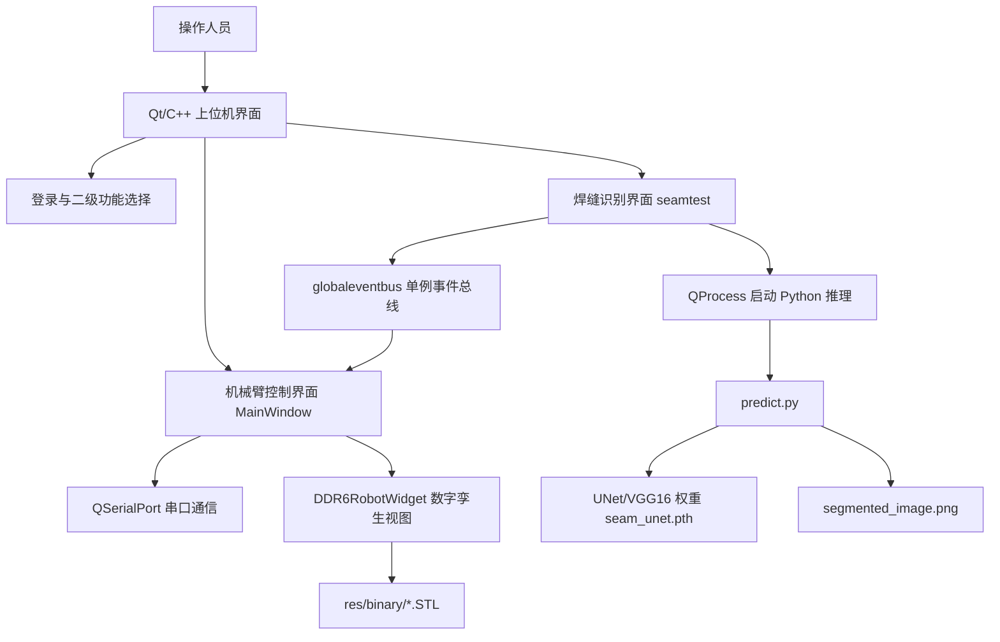
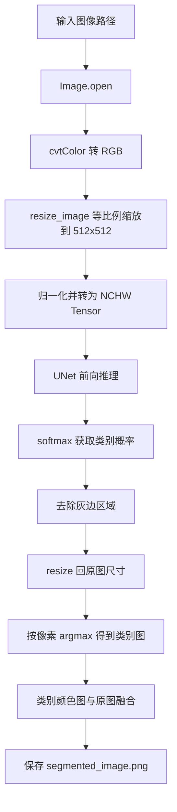
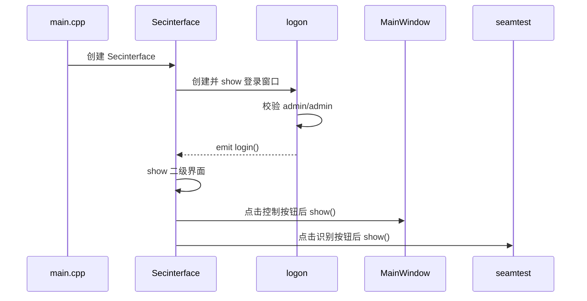
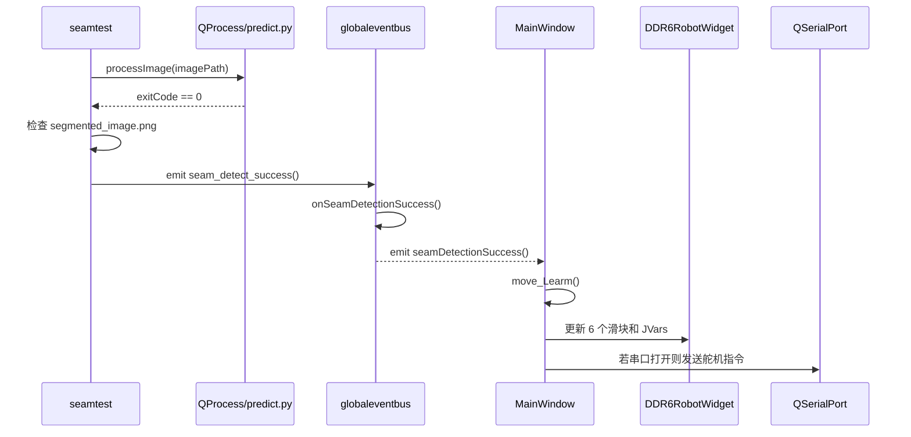



## 开源仓库与资源边界

项目开源仓库：[https://github.com/Bill-xing/HMI](https://github.com/Bill-xing/HMI)

代码已开源；数据集、模型权重和 LeArm STL 结构资源按照 README 与技术文档中的边界单独说明。本文保留工程实现、算法训练、Qt/OpenGL 集成和数字孪生细节，并把原始技术文档中的关键图片转存到网站静态目录，避免本地导出路径导致坏链。

## 项目概览

HMI 是面向幻尔科技 Hiwonder LeArm 机械臂平台的非官方二次开发上位机，主要用于焊缝识别、UNet 图像分割推理和机械臂数字孪生滑块控制演示。Qt/OpenGL 机械臂三维显示参考 [eagleqq/Robot3D](https://github.com/eagleqq/Robot3D)，UNet 训练、推理与 mIoU 评估流程参考 [bubbliiiing/unet-pytorch](https://github.com/bubbliiiing/unet-pytorch)。本项目在此基础上完成 LeArm 模型适配、Qt 上位机界面整合、焊缝识别推理调用、滑块式关节仿真控制和桌面应用打包验证。

| 模块 | 关键内容 |
| --- | --- |
| Qt/C++ 上位机 | `logon`、`secinterface`、`mainwindow`、`seamtest` 界面与业务逻辑 |
| 识别推理 | `predict.py` 通过 `QProcess` 调用，默认使用 `model_data/seam_unet.pth` |
| 数据与训练 | 自采焊缝数据集，`json_to_dataset.py` 将 LabelMe JSON 转 VOC mask |
| 数字孪生 | `DDR6RobotWidget` 加载 `base_link.STL` 到 `link_5.STL` 并按 DH 参数渲染 |
| 路径管理 | `runtime_paths.cpp` 统一处理工程根目录、Python 环境和输出路径 |
| 本地配置 | `scripts/hmi_local_env.example.sh` 仅作为本机路径配置样例，真实配置不提交 |

## 资源边界

| 内容 | 状态 |
| --- | --- |
| 仓库代码 | 已开源，仓库地址为 [Bill-xing/HMI](https://github.com/Bill-xing/HMI) |
| 焊缝分割数据集 | 作者自采，不直接提交到 Git，说明采用 CC BY 4.0 |
| 自训练 UNet 权重 | 默认文件名 `seam_unet.pth`，不写入 Git 历史，说明采用 Apache License 2.0 |
| LeArm STL/结构模型 | 仓库不提供，不授权二次分发；本地演示需自行准备有权使用的 STL |
| 默认登录 | 演示账号为 `username: admin`、`password: admin`，只用于界面流程演示 |

## 演示效果

| 机械臂识别到焊缝 | 滑块控制独立关节 |
| --- | --- |
| [](https://youtu.be/_f371G87iBs?si=kt9yl1vsSmSuFXPl) | [](https://youtu.be/tFxSIknCsfQ?si=BHSCSx6OC0wbLYiz) |

原视频链接：

- [机械臂识别到焊缝的效果视频](https://youtu.be/_f371G87iBs?si=kt9yl1vsSmSuFXPl)
- [通过滑块控制机械臂各个独立关节的场景](https://youtu.be/tFxSIknCsfQ?si=BHSCSx6OC0wbLYiz)

## 参考项目与授权边界

第三方来源与许可证说明见 [THIRD_PARTY_NOTICES.zh-CN.md](THIRD_PARTY_NOTICES.zh-CN.md)。

- [bubbliiiing/unet-pytorch](https://github.com/bubbliiiing/unet-pytorch)：UNet 训练、推理和 mIoU 评估流程的主要参考项目，原项目采用 MIT License。
- [eagleqq/Robot3D](https://github.com/eagleqq/Robot3D)：Qt/OpenGL 机械臂三维显示、STL 加载和关节控制部分的主要参考项目。
- LeArm 机械臂 STL/结构模型：本仓库只说明适配方式和期望文件名，不提供 STL 文件。
- 模型权重：`model_data/seam_unet.pth` 为本项目任务场景下训练得到的权重文件，默认不提交到 Git 仓库。

本仓库当前不声明一个覆盖全部内容的统一开源许可证。公开发布前仍应确认代码、STL 资源和第三方依赖的许可条件；数据集与权重的许可证以上述说明为准。

## 详细技术文档

# 面向焊缝识别的机器人孪生上位机技术文档

## 1. 文档说明

本文档依据以下材料整理：

- 毕业论文：`要交给老师的电子版文件/02_邢鉴明_2021212307_ZX_LW.pdf`
- 源码工程：`HMI`
- 补充参考：`要交给老师的电子版文件/02_邢鉴明_2021212307_ZX_LW.docx`

文档重点说明系统的工程实现，而不是简单复述论文。内容覆盖焊缝语义分割、Qt/C++ 上位机、串口控制、OpenGL 数字孪生、模块联动、复现部署和验证方法。论文中的关键图片已经转存为网站静态资源，并在对应技术章节中引用。

## 3. 总体架构

### 3.1 架构分层

系统由四个主要层次组成：



各层职责如下：

| 层级 | 主要组件 | 职责 |
| --- | --- | --- |
| 界面层 | `logon.ui`、`secinterface.ui`、`mainwindow.ui`、`seamtest.ui` | 登录、功能入口、图像显示、串口参数配置、滑块控制 |
| 业务层 | `logon.cpp`、`secinterface.cpp`、`mainwindow.cpp`、`seamtest.cpp` | 流程调度、信号槽连接、串口指令组包、图像处理进程管理 |
| 算法层 | `predict.py`、`unet.py`、`nets/`、`utils/`、`train.py` | 模型训练、推理、mIoU 评估、数据增强 |
| 渲染层 | `rrglwidget.cpp`、`ddr6robotwidget.cpp`、`stlfileloader.cpp` | OpenGL 初始化、STL 二进制解析、机械臂关节变换和交互渲染 |
| 运行时支撑 | `runtime_paths.cpp`、`scripts/`、`docs/reproduction/` | 项目根目录发现、Python 环境定位、输出目录管理、打包复现 |

### 3.2 工程目录

`HMI` 的关键目录和文件如下：

```text
HMI/
├── HMI.pro                         # Qt qmake 工程文件
├── main.cpp                        # 应用入口与 --self-test 自测入口
├── logon.*                         # 登录窗口
├── secinterface.*                  # 二级功能选择窗口
├── mainwindow.*                    # 机械臂控制与串口通信窗口
├── seamtest.*                      # 焊缝识别窗口
├── globaleventbus.*                # 识别成功事件总线
├── runtime_paths.*                 # 运行路径、Python 环境、输出路径定位
├── rrglwidget.*                    # OpenGL 基础渲染窗口
├── ddr6robotwidget.*               # LeArm 机械臂数字孪生渲染
├── stlfileloader.*                 # STL 文件解析与绘制
├── predict.py                      # 单张图片推理入口
├── unet.py                         # 推理封装类
├── train.py                        # 训练脚本
├── get_miou.py                     # mIoU 评估入口
├── json_to_dataset.py              # LabelMe JSON 到分割数据集转换
├── nets/                           # UNet/VGG16 网络结构
├── utils/                          # 数据加载、损失、训练、指标工具
├── model_data/                     # 模型权重目录，默认使用 seam_unet.pth
├── res/binary/                     # LeArm STL 文件目录，本仓库不公开分发 STL
├── docs/                           # 数据集、权重、复现、打包说明
└── scripts/                        # 本地环境与打包脚本
```

### 3.3 构建与依赖

Qt 工程使用 `HMI.pro` 管理，关键配置如下：

| 配置项 | 内容 |
| --- | --- |
| Qt 模块 | `core`、`gui`、`widgets`、`serialport`、`opengl` |
| C++ 标准 | C++17 |
| Python 集成 | 通过 `PYTHON_HOME`、`PYTHON_VERSION` 设置 Python 头文件与动态库路径 |
| macOS rpath | 指向 `PYTHON_HOME/lib` 和应用包内 `Resources/python/lib` |
| 资源 | `res.qrc`，包含界面图片资源 |
| 源文件 | 控制、识别、事件总线、运行路径、OpenGL、STL 加载等 C++ 文件 |

Python 依赖记录在 `requirements.txt` 中，主要包括：

| 依赖 | 版本 | 用途 |
| --- | --- | --- |
| `torch` | 1.10.2 | 模型训练与推理 |
| `torchvision` | 0.11.3 | 视觉模型和预处理生态 |
| `opencv-python` | 4.1.2.30 | 图像 resize、颜色空间转换、后处理 |
| `Pillow` | 8.3.1 | 图像读写与融合 |
| `numpy` | 1.19.2 | 数组计算 |
| `labelme` | 3.16.7 | 标注数据处理 |
| `matplotlib` | 3.3.4 | 训练曲线与评估可视化 |
| `tqdm` | 4.60.0 | 训练进度条 |

## 4. 焊缝语义分割模块

### 4.1 技术流程

焊缝识别模块使用 U-Net 系列语义分割网络。完整流程为：采集多角度、多光照焊缝图像，使用 LabelMe 标注焊缝区域，将 JSON 标注转换为 VOC 风格数据集，训练 VGG-UNet 模型，评估 mIoU，最后通过 `predict.py` 在上位机中执行单张图片推理。


图 2-1 U-Net 语义分割流程

### 4.2 数据采集与标注

焊缝分割任务采用像素级标注。与目标检测只标注矩形框不同，语义分割需要为每个像素分配类别，因此必须生成与原始图像同尺寸的 mask。论文中使用 LabelMe 对焊缝边缘进行多边形勾画。


图 2-2 LabelMe 语义分割标签数据集制作示例

数据集类别定义为二分类：

| 类别索引 | 类别名 | 含义 |
| --- | --- | --- |
| 0 | `_background_` | 背景 |
| 1 | `seam` | 焊缝 |

公开数据集说明中记录的划分为：

| 划分 | 数量 |
| --- | ---: |
| train | 845 |
| val | 94 |
| trainval | 939 |
| test | 0 |

VOC 风格目录结构如下：

```text
VOC2007/
├── JPEGImages/                 # 原始图像
├── SegmentationClass/          # 分割标签 mask
└── ImageSets/
    └── Segmentation/
        ├── train.txt
        ├── val.txt
        └── trainval.txt
```

### 4.3 LabelMe JSON 到 VOC mask 的转换

转换脚本为 `json_to_dataset.py`。核心逻辑如下：

1. 扫描 `datasets/before/` 下的 LabelMe JSON 文件。
2. 从 JSON 的 `imageData` 字段或 `imagePath` 字段读取原图。
3. 使用 `labelme.utils.shapes_to_label` 将多边形标注转为像素标签矩阵。
4. 构造类别映射：`_background_ -> 0`，`seam -> 1`。
5. 原图保存到 `datasets/JPEGImages`，mask 保存到 `datasets/SegmentationClass`。


图 2-3 蒙版图像

工程实现中需要注意两个约束：

- mask 必须使用类别索引，而不是 RGB 彩色值。训练时 `utils/dataloader.py` 会将 mask 转为 one-hot 标签。
- 标签图 resize 必须使用最近邻方式，避免连续插值破坏类别索引。

### 4.4 网络结构

#### 4.4.1 U-Net 基础结构

U-Net 由编码器、解码器和跳跃连接组成。编码器逐级下采样提取局部到全局特征，解码器逐级上采样恢复空间分辨率，跳跃连接将编码阶段的细节特征与解码阶段的语义特征拼接，提升边缘恢复能力。


图 2-8 U-Net 网络结构

#### 4.4.2 VGG-UNet 优化结构

项目最终采用 `backbone = "vgg"` 的 VGG-UNet。其编码器使用 VGG16 提取多尺度特征，解码阶段通过 `unetUp` 模块逐级恢复空间分辨率，并与编码阶段的同尺度特征进行拼接。该结构比最初的 U-Net 方案更适合本项目的小样本焊缝分割场景。


图 2-10 VGG16 网络结构


图 2-11 VGG-UNet 网络示意图

`nets/unet.py` 中的实现要点如下：

1. `Unet` 类通过 `backbone` 参数在 VGG16 编码器和原始 U-Net 编码器之间切换。
2. VGG 模式下，编码器输出五级特征 `feat1` 到 `feat5`。
3. 解码阶段依次执行 `up_concat4`、`up_concat3`、`up_concat2`、`up_concat1`。
4. 输出层生成 2 类像素 logits，对应背景与焊缝。

执行顺序可概括为：

```text
up4 = up_concat4(feat4, feat5)
up3 = up_concat3(feat3, up4)
up2 = up_concat2(feat2, up3)
up1 = up_concat1(feat1, up2)
final = output_layer(up1)
```

这种结构适合焊缝边缘分割的原因包括：

1. VGG16 预训练特征能够改善小数据集训练时的收敛速度和泛化能力。
2. U-Net 跳跃连接保留浅层边缘和纹理信息，有利于恢复细长焊缝边界。
3. 二分类输出减少类别竞争，任务目标集中于“焊缝/背景”。

### 4.5 训练配置

训练入口为 `train.py`。主要超参数如下：

| 参数 | 当前值 | 说明 |
| --- | --- | --- |
| `Cuda` | `True` | 优先使用 GPU |
| `num_classes` | `2` | 背景 + 焊缝 |
| `backbone` | `"vgg"` | 使用 VGG16 编码器 |
| `pretrained` | `True` | 使用预训练权重初始化 |
| `model_path` | `model_data/seam_unet.pth` | 继续加载或微调已有权重 |
| `input_shape` | `[512, 512]` | 网络输入尺寸 |
| `Freeze_Epoch` | `50` | 冻结阶段训练到第 50 轮 |
| `Freeze_batch_size` | `2` | 冻结阶段 batch size |
| `Freeze_lr` | `1e-4` | 冻结阶段学习率 |
| `UnFreeze_Epoch` | `100` | 解冻阶段训练到第 100 轮 |
| `Unfreeze_batch_size` | `2` | 解冻阶段 batch size |
| `Unfreeze_lr` | `1e-5` | 解冻阶段学习率 |
| `dice_loss` | `True` | 使用 Dice Loss 辅助小目标分割 |
| `focal_loss` | `False` | 当前未启用 Focal Loss |
| `optimizer` | Adam | 自适应优化器 |
| `lr_scheduler` | StepLR, gamma=0.96 | 每轮衰减学习率 |
| `num_workers` | `4` | 数据加载线程数 |

训练流程为：


### 4.6 数据增强与预处理

`utils/dataloader.py` 中 `get_random_data()` 实现训练增强，验证阶段则只执行等比例缩放和居中填充。

训练阶段增强包括：

| 增强方式 | 实现细节 | 目的 |
| --- | --- | --- |
| 随机宽高比扰动 | `jitter=.3`，随机生成新宽高比 | 提升对不同拍摄角度和焊缝形态的适应能力 |
| 随机缩放 | `scale` 在 0.25 到 2 之间 | 提升尺度鲁棒性 |
| 水平翻转 | 50% 概率 | 增强方向不变性 |
| 随机位置粘贴 | 将缩放图像粘贴到 512x512 灰色背景 | 模拟目标位置变化 |
| HSV 颜色扰动 | 色调、饱和度、亮度随机变化 | 提升复杂光照下的识别稳定性 |

输入图像预处理流程：

1. 使用 `cvtColor()` 确保输入为 RGB。
2. 使用 `resize_image()` 等比例缩放到 `512x512`，不足部分填充灰色背景。
3. 使用 `preprocess_input()` 做归一化。
4. 将维度从 `HWC` 转换为 `CHW`，再增加 batch 维度。

标签处理流程：

1. mask 使用最近邻插值缩放，防止类别编号被破坏。
2. 将超出类别范围的像素设置为 `num_classes`。
3. 使用 `np.eye(num_classes + 1)` 转为 one-hot 标签，供 Dice/F-score 等计算使用。

### 4.7 损失函数与评价指标

训练中默认损失为交叉熵损失加 Dice Loss。Dice Loss 对小目标分割更友好，可缓解焊缝区域占图像比例较小导致的类别不平衡。

```math
DiceLoss = 1 - \frac{2|X \cap Y|}{|X| + |Y|}
```

其中 `X` 为预测区域，`Y` 为真实标注区域。

评价指标采用像素级 IoU、PA Recall 和 Precision：

```math
PA\_Recall = \frac{TP}{TP + FN}
```

```math
Precision = \frac{TP}{TP + FP}
```

```math
IoU = \frac{TP}{TP + FP + FN}
```

| 符号 | 含义 |
| --- | --- |
| TP | 焊缝区域被正确识别的像素数量 |
| FP | 背景区域被误判为焊缝的像素数量 |
| FN | 实际焊缝区域未被识别的像素数量 |
| TN | 背景区域被正确排除的像素数量 |


图 2-9 交并比示意图

### 4.8 模型优化结果

论文记录的优化过程包括三步：

1. 从原始 U-Net 切换到 VGG-UNet，分割准确率从约 64% 提升到约 87%。
2. 引入 VGG16 预训练权重，分割准确率从约 87% 提升到约 89%。
3. 将数据集从 30 张扩展到 939 张，最终分割准确率达到约 96.8%。

| VGG-UNet 的 mIoU | 原始 U-Net 的 mIoU |
| --- | --- |
|  |  |

图 2-12 至图 2-13 模型结构优化对比

| 未使用预训练 | 使用预训练 |
| --- | --- |
|  |  |

图 2-14 至图 2-15 预训练权重对比

| 30 张数据集 | 939 张数据集 |
| --- | --- |
|  |  |

图 2-16 至图 2-17 数据集扩充对比

优化前后效果如下：


图 2-18 语义分割效果对比图

### 4.9 推理流程

推理入口为 `predict.py`，封装类为 `unet.py` 中的 `Unet`。默认配置：

| 配置项 | 默认值 |
| --- | --- |
| `model_path` | `model_data/seam_unet.pth` |
| `num_classes` | `2` |
| `backbone` | `"vgg"` |
| `input_shape` | `[512, 512]` |
| `mix_type` | `0` |
| `cuda` | `True`，但会自动降级为 `torch.cuda.is_available()` |

单张图像推理步骤：



在 `mix_type == 0` 下，分割 mask 会映射为颜色图，再通过 `Image.blend(old_img, image, 0.7)` 与原图融合。融合权重含义是结果图像中分割颜色占比较高，便于在上位机中直观看到焊缝区域。


图 2-19 焊缝分割上位机效果演示

## 5. Qt/C++ 上位机控制模块

### 5.1 从 PyQt 原型到 C++ Qt 重构

论文中先使用 PyQt 快速搭建原型，再因数字孪生渲染实时性、OpenGL 交互和底层集成需要，将上位机重构为 C++ Qt。C++ Qt 的优势包括：

1. 编译型语言运行效率高，适合高频界面刷新和 OpenGL 渲染。
2. 直接使用 Qt SerialPort、OpenGL、信号槽等模块，减少 Python 解释器带来的开销。
3. 更适合与 C++ STL 解析、底层硬件通信和桌面应用打包集成。
4. 可以借助 qmake 和 macdeployqt/windeployqt 形成可分发应用包。

原型阶段使用 Qt Designer 进行界面布局绘制，形成 `.ui` 文件，再由代码绑定具体业务逻辑。C++ Qt 重构后仍保留这种“界面描述文件 + C++ 槽函数”的组织方式，使界面调整和逻辑实现相对分离。


图 3-2 Qt Designer 设计界面

### 5.2 应用启动与窗口层级

启动入口在 `main.cpp`。正常模式下创建 `Secinterface` 对象，但 `Secinterface` 构造函数首先显示登录窗口 `logon`，而不是直接显示主界面。



登录窗口使用默认账号：

```text
username: admin
password: admin
```

登录状态保存使用 `RuntimePaths::outputPath("config.json")`，而不是写在工程源码目录中。保存内容只记录“是否记住账号/密码”的 checkbox 状态。


图 3-9 上位机登录界面


图 3-10 上位机二级界面

| 登录界面优化 | 二级界面优化 |
| --- | --- |
|  |  |

图 3-11 至图 3-12 登录界面与二级界面效果

### 5.3 串口控制逻辑

机械臂控制窗口由 `MainWindow` 实现，串口对象为 `QSerialPort *serialPort`。初始化函数 `initSerialPort()` 完成按钮、滑块、下拉框和事件总线信号的连接。


图 3-1 上位机控制逻辑图

串口控制流程如下：

1. 点击“检测串口”按钮，调用 `portDetect()`。
2. `QSerialPortInfo::availablePorts()` 返回当前系统所有串口。
3. 将 `portName:description` 添加到串口下拉框。
4. 点击“打开串口”按钮，调用 `portOpenClose()`。
5. 设置串口名、波特率、数据位、校验位和停止位。
6. 调用 `serialPort->open(QIODevice::ReadWrite)` 打开串口。
7. 滑块变化或文本发送触发组包，调用 `sendData()` 写入串口。

默认串口参数：

| 参数 | 默认值 |
| --- | --- |
| 波特率 | 9600 |
| 数据位 | 8 |
| 校验位 | N |
| 停止位 | 1 |

界面分区示意：

| 文本交互 | 串口设置 | 舵机控制 |
| --- | --- | --- |
|  |  |  |

图 3-3 至图 3-5 控制模块界面分区

串口检测后的界面会将可用端口写入下拉框；如果没有检测到端口，则显示无可用串口提示。该流程在 PyQt 原型和 C++ Qt 重构中保持一致，只是底层从 `serial.tools.list_ports` 切换为 Qt 原生的 `QSerialPortInfo::availablePorts()`。


图 3-6 串口检测模块显示效果

### 5.4 舵机控制协议

`MainWindow::showSliderValue()` 在滑块变化时构建舵机控制命令。当前单舵机控制数据包格式如下：

| 字节序号 | 字段 | 当前值或来源 | 说明 |
| --- | --- | --- | --- |
| 0 | 帧头 1 | `0x55` | 固定帧头 |
| 1 | 帧头 2 | `0x55` | 固定帧头 |
| 2 | 长度 | `0x08` | 当前包长度字段 |
| 3 | 命令 | `0x03` | 舵机移动命令 |
| 4 | 舵机数量 | `0x01` | 单次控制一个舵机 |
| 5 | 时间低八位 | `0xC8` | 运动时间低位，十进制 200 |
| 6 | 时间高八位 | `0x00` | 运动时间高位 |
| 7 | 舵机 ID | `sliderNumber` | 1 到 6 |
| 8 | 角度低八位 | `value & 0xFF` | 滑块值低位 |
| 9 | 角度高八位 | `(value >> 8) & 0xFF` | 滑块值高位 |

论文中给出的多舵机数据长度公式为：

```math
N = servo\_num \times 3 + 5
```

当前源码在滑块单舵机控制中使用固定 `servo_num = 1` 的等价格式。文本发送路径 `sendMessage()` 还支持普通文本模式和 HEX 模式：若界面 checkbox 选中，则按空格拆分十六进制字符串并逐字节转换；否则按 UTF-8 文本发送。

`sendData()` 中包含以下鲁棒性处理：

1. 串口未打开时不发送。
2. 打印发送数据包大小和十六进制内容，便于调试。
3. 使用 `serialPort->write(data)` 写入。
4. 使用 `waitForBytesWritten(1000)` 等待最多 1 秒。
5. 发送失败或超时时弹窗提示。

### 5.5 滑块到数字孪生关节角的映射

滑块范围设置为 `500` 到 `2500`，默认值如下：

| 舵机 | 默认滑块值 |
| --- | ---: |
| 1 | 1000 |
| 2 | 1500 |
| 3 | 1500 |
| 4 | 1500 |
| 5 | 1500 |
| 6 | 1500 |

基础映射函数为：

```cpp
double MainWindow::mapRange(double value,
                            double inMin, double inMax,
                            double outMin, double outMax) {
    if (value < inMin) value = inMin;
    if (value > inMax) value = inMax;
    return (value - inMin) * (outMax - outMin) / (inMax - inMin) + outMin;
}
```

即将 `[500, 2500]` 映射到 `[-90, 90]`。随后 `slotJVarsValueChange()` 根据关节编号做额外修正：

| 关节索引 | 修正逻辑 | 目的 |
| --- | --- | --- |
| `index == 5` | `mappedValue += 90` | 补偿第五关节模型初始姿态 |
| `index == 3` | `mappedValue -= 90` 后再 `mappedValue = -180 - mappedValue` | 适配第三关节 STL 坐标方向 |
| `index == 4` | `mappedValue = -mappedValue` | 适配第四关节旋转方向 |
| 其他 | 仅线性映射 | 保持常规角度映射 |

由于 UI 滑块编号与 `mRobotConfig.JVars` 下标方向相反，源码使用 `mappedIndex = 7 - index` 写入数字孪生关节变量。


图 3-7 滑块数值与文本框数值双向交互


图 3-8 舵机控制模块效果显示

### 5.6 焊缝识别窗口与 Python 推理集成

识别窗口由 `seamtest` 类实现，核心函数包括：

| 函数 | 作用 |
| --- | --- |
| `selectImage()` | 打开文件选择框，选择待识别图片 |
| `displayOriginalImage()` | 将原图显示到左侧 QLabel |
| `processImage()` | 使用 QProcess 启动 Python 推理脚本 |
| `displayResult()` | 加载并显示 `segmented_image.png` |
| `seam_detect_success` | 识别成功后发射的 Qt 信号 |

`processImage()` 的关键实现：

1. 创建 `QProcess`。
2. 使用 `RuntimePaths::projectRoot()` 定位 `predict.py`。
3. 使用 `RuntimePaths::pythonExecutable()` 定位 Python 解释器。
4. 使用 `RuntimePaths::outputDir()` 作为子进程工作目录，使输出结果写入稳定位置。
5. 参数为：`predict.py <image_path>`。
6. 连接 `readyReadStandardOutput` 和 `readyReadStandardError` 输出日志。
7. 连接 `errorOccurred` 捕获启动失败、崩溃、超时、读写错误等异常。
8. 进程退出码为 0 时，延迟 500 ms 检查结果文件。
9. 若 `segmented_image.png` 存在，显示结果并发射 `seam_detect_success()`。
10. 使用 `deleteLater()` 安全释放进程对象。

这种设计避免了 C++ 直接嵌入 PyTorch 推理代码的复杂性，也避免将模型推理阻塞在 UI 主流程中。

### 5.7 运行时路径管理

`runtime_paths.cpp` 解决桌面应用在源码运行、构建目录运行、`.app` 包内运行等不同场景下的路径定位问题。核心函数如下：

| 函数 | 作用 |
| --- | --- |
| `envValue()` | 读取环境变量 |
| `projectRoot()` | 查找包含 `predict.py` 的项目根目录 |
| `resourcePath()` | 根据项目根目录拼接资源路径 |
| `pythonHome()` | 查找 Python 环境根目录 |
| `pythonExecutable()` | 返回 Python 可执行文件路径 |
| `pythonStringLiteral()` | 转义路径，供 Python C API 字符串使用 |
| `outputDir()` | 返回运行时输出目录 |
| `outputPath()` | 拼接输出文件路径 |

路径优先级：

1. 若设置了 `HMI_PROJECT_ROOT`，优先使用该路径。
2. 否则从当前目录、应用目录、`HMI`、`runtime/HMI`、`resources/HMI`、macOS `Resources/HMI` 等候选目录中寻找 `predict.py`。
3. Python 优先使用 `PYTHON_EXECUTABLE`，其次根据 `PYTHON_HOME` 推导，最后回退到 `python`。
4. 输出目录优先使用 `HMI_OUTPUT_DIR`，否则使用 `QStandardPaths::AppDataLocation`，再回退到临时目录。

## 6. 数字孪生模块

### 6.1 机械臂对象与建模目标

数字孪生模块基于 LeArm 六自由度机械臂。论文中通过改进 DH 参数推导正逆运动学，并在上位机中使用 STL 模型和 OpenGL 显示机械臂姿态。

| LeArm 机械臂 | 机械臂结构简图 |
| --- | --- |
|  |  |

图 4-1 至图 4-2 LeArm 机械臂与结构简图

### 6.2 改进 DH 参数

坐标系搭建采用改进 DH 方法：


图 4-3 改进 DH 坐标系示意图

论文给出的尺寸为：

```text
d1 = 95 mm
d2 = 9.5 mm
d3 = 104 mm
d4 = 88.47 mm
d5 = 59.28 mm
```

改进 DH 参数表如下：

| i | a(i-1) | alpha(i-1) | d(i) | theta(i) |
| --- | ---: | ---: | ---: | ---: |
| 1 | 0 | 0 | d1 | 0 |
| 2 | d2 | -pi/2 | 0 | -pi/2 |
| 3 | d3 | 0 | 0 | 0 |
| 4 | d4 | 0 | 0 | -pi/2 |
| 5 | 0 | -pi/2 | d5 | -pi/2 |
| 6 | 0 | pi/2 | 0 | 0 |

源码中 `DDR6RobotWidget::configureModelParams()` 使用的渲染参数为：

```cpp
mRobotConfig.d     = {0, 95.0, 0.00, 0.00, 0.00, 59.28, 0.00};
mRobotConfig.JVars = {0, 0, 90, 0, -90, 0, 0};
mRobotConfig.a     = {0, 0, -9.8, 104, 88.47, 0, 0};
mRobotConfig.alpha = {0, 0, 90, 0, 0, -90, 0};
```

这里的数组首位为占位项，实际关节从下标 1 开始。`a[2] = -9.8` 对应论文中 `d2 = 9.5 mm` 附近的结构偏置，但源码中根据 STL 坐标实际对齐做了符号和数值微调。

### 6.3 正运动学

改进 DH 的单级齐次变换可写为：

```math
^{i-1}T_i =
R_X(\alpha_{i-1})
D_X(a_{i-1})
R_Z(\theta_i)
D_Z(d_i)
```

矩阵形式为：

```math
^{i-1}T_i =
\begin{bmatrix}
\cos\theta_i & -\sin\theta_i & 0 & a_{i-1} \\
\sin\theta_i\cos\alpha_{i-1} & \cos\theta_i\cos\alpha_{i-1} & -\sin\alpha_{i-1} & -\sin\alpha_{i-1}d_i \\
\sin\theta_i\sin\alpha_{i-1} & \cos\theta_i\sin\alpha_{i-1} & \cos\alpha_{i-1} & \cos\alpha_{i-1}d_i \\
0 & 0 & 0 & 1
\end{bmatrix}
```

整机末端位姿为：

```math
^0T_i = ^0T_1 \cdot ^1T_2 \cdot \ldots \cdot ^{i-1}T_i
```

在 OpenGL 渲染中，源码不直接构造矩阵对象，而是按照 DH 变换顺序调用：

```cpp
glTranslatef(a, 0.0, 0.0);
glRotatef(alpha, 1.0, 0.0, 0.0);
glTranslatef(0.0, 0.0, d);
glRotatef(theta, 0.0, 0.0, 1.0);
```

这种做法利用 OpenGL 矩阵栈隐式累乘，实现每个连杆相对于前一连杆的级联变换。

### 6.4 逆运动学与验证

论文中通过矩阵对应关系求解 `theta1` 到 `theta6` 的解析表达式。逆解核心思想是：

1. 利用末端齐次矩阵中的位置项先求 `theta1`。
2. 使用姿态矩阵相关元素消去部分变量，求 `theta5` 和 `theta6`。
3. 通过组合角 `theta234` 处理腕部姿态。
4. 利用几何关系求 `theta2`、`theta3`。
5. 最后由 `theta4 = theta234 - theta2 - theta3` 得到第四关节角。

由于机械臂逆运动学通常存在多解、奇异位形和不可达位姿，论文中记录了八组候选解，其中部分解为 `NaN`。这符合六自由度串联机械臂解析逆解的一般现象。

使用 Robotic Toolbox 对正逆解互相验证：


图 4-4 Robotic Toolbox 仿真图

正解测试数据：

| 输入关节角 | 末端位姿矩阵 |
| --- | --- |
| `[pi/4, -2*pi/3, -2*pi/3, 0, 2*pi/3, 0]` | `[[0.7891, -0.6124, 0.0474, -9.6593], [-0.4356, -0.6124, -0.6597, -9.6593], [0.4330, 0.5000, -0.7500, 15.0000], [0, 0, 0, 1.0000]]` |

逆解测试中，`T2` 与预设 `T0` 一致，说明解析逆解和正解在该测试点上互为验证。

### 6.5 STL 模型加载

机械臂各连杆使用二进制 STL 文件，默认路径为：

```text
res/binary/
├── base_link.STL
├── link_1.STL
├── link_2.STL
├── link_3.STL
├── link_4.STL
└── link_5.STL
```


图 4-5 关节零件

`STLFileLoader::loadBinaryStl()` 按二进制 STL 规范解析文件：

| 字节范围 | 内容 | 大小 |
| --- | --- | ---: |
| 0-79 | 文件头 | 80 字节 |
| 80-83 | 三角面片数量 `triangle_num` | 4 字节 |
| 每个面片 | 法向量 + 三个顶点 + 属性字段 | 50 字节 |

单个三角面片结构：

| 字段 | 内容 | 大小 |
| --- | --- | ---: |
| normal | 3 个 float | 12 字节 |
| vertex 1 | 3 个 float | 12 字节 |
| vertex 2 | 3 个 float | 12 字节 |
| vertex 3 | 3 个 float | 12 字节 |
| attribute | 属性字节计数 | 2 字节 |

因此文件体积理论上为：

```math
FileSize = 84 + 50 \times N_{facet}
```

源码一次性将文件读入内存，然后通过指针偏移解析，优点是逻辑简单、读取速度快；代价是大模型会占用较多瞬时内存。当前 LeArm 演示模型规模较小，该方案是合理的。

### 6.6 OpenGL 渲染管线

渲染基础类为 `RRGLWidget`，继承自 `QGLWidget`。其职责包括：

| 函数 | 作用 |
| --- | --- |
| `initializeGL()` | 设置光照、深度测试、法向量归一化、背景色 |
| `resizeGL()` | 设置视口和透视投影矩阵 |
| `paintGL()` | 子类重写后执行每帧绘制 |
| `drawGrid()` | 绘制地面网格 |
| `drawCoordinates()` | 绘制世界坐标系 |
| `drawSTLCoordinates()` | 绘制局部 STL 坐标系 |
| `setupColor()` | 设置材质颜色 |
| `mouseMoveEvent()` | 处理旋转、缩放、平移交互 |

`STLFileLoader::draw()` 使用立即模式绘制：

```cpp
glBegin(GL_TRIANGLES);
for each triangle:
    glNormal3f(normal.x, normal.y, normal.z);
    glVertex3f(vertex0.x, vertex0.y, vertex0.z);
    glVertex3f(vertex1.x, vertex1.y, vertex1.z);
    glVertex3f(vertex2.x, vertex2.y, vertex2.z);
glEnd();
```

该方式便于学习和验证 STL 加载逻辑，但在大规模模型或高帧率场景下，可进一步升级为 VBO/VAO 缓冲对象渲染，以减少 CPU 到 GPU 的重复提交。

### 6.7 机械臂关节级渲染

`DDR6RobotWidget` 继承 `RRGLWidget`，负责加载各连杆 STL，并按关节顺序进行矩阵变换和绘制。

初始化视角：

```cpp
z_zoom = -500;
xRot = 30 * 16;
yRot = 45 * 16;
xTran = 0;
yTran = -200;
```

`paintGL()` 中先清除颜色和深度缓冲，再依次应用观察变换：

```cpp
glTranslated(0, 0, z_zoom);
glTranslated(xTran, yTran, 0);
glRotated(xRot / 16.0, 1.0, 0.0, 0.0);
glRotated(yRot / 16.0, 0.0, 1.0, 0.0);
glRotated(zRot / 16.0, 0.0, 0.0, 1.0);
glRotated(+90.0, 1.0, 0.0, 0.0);
glRotated(180.0, 1.0, 0.0, 0.0);
drawGL();
```

`drawGL()` 中按照基座、link1、link2、link3、link4、link5 的顺序绘制。每绘制一个连杆前，先执行对应的 DH 平移和旋转，再调用该连杆的 `draw()`。因为使用 OpenGL 当前矩阵状态，后续连杆自然继承前序关节变换。

机械臂模型状态与实物状态对比如下：

| 上位机状态 1 | 实物状态 1 |
| --- | --- |
|  |  |

| 上位机状态 2 | 实物状态 2 |
| --- | --- |
|  |  |

图 4-6 机械臂上位机模型状态与机械臂状态对比图

### 6.8 鼠标交互

`RRGLWidget::mouseMoveEvent()` 实现三种交互：

| 鼠标操作 | 控制变量 | 效果 |
| --- | --- | --- |
| 左键拖动 | `xRot`、`yRot` | 旋转观察视角 |
| 右键拖动 | `z_zoom` | 缩放视图 |
| 中键拖动 | `xTran`、`yTran` | 平移视图 |

Qt 角度变量采用 `角度 * 16` 的存储方式，因此 `paintGL()` 中渲染时使用 `xRot / 16.0` 还原为角度。

## 7. 模块联动机制

### 7.1 识别成功到机械臂运动的事件链

焊缝识别模块与机械臂控制模块之间通过 `globaleventbus` 解耦。事件链如下：



`globaleventbus` 是一个 QObject 单例：

```cpp
static globaleventbus* getInstance() {
    static globaleventbus instance;
    return &instance;
}
```

`seamtest` 构造函数中连接：

```cpp
connect(this, SIGNAL(seam_detect_success()),
        globaleventbus::getInstance(),
        SLOT(onSeamDetectionSuccess()));
```

`MainWindow::initSerialPort()` 中连接：

```cpp
connect(globaleventbus::getInstance(),
        SIGNAL(seamDetectionSuccess()),
        this,
        SLOT(move_Learm()));
```

这种发布-订阅式设计的优点是 `seamtest` 不需要持有 `MainWindow` 指针，两个窗口的生命周期和显示逻辑可以保持独立。

### 7.2 预设运动姿态

识别成功后，`MainWindow::move_Learm()` 将六个滑块设置为固定值：

| 舵机 | 目标滑块值 |
| --- | ---: |
| 1 | 1015 |
| 2 | 1162 |
| 3 | 1757 |
| 4 | 1647 |
| 5 | 1412 |
| 6 | 1640 |

设置滑块会触发已有的 `valueChanged` 信号链，从而同时更新：

1. UI 文本框显示。
2. 数字孪生模型关节角。
3. 串口发送数据包。

因此 `move_Learm()` 不需要直接调用 OpenGL 刷新或串口发送函数，复用了滑块控制链路。

## 8. 运行资源边界

本节只保留复现时需要理解的资源和路径边界，不展开命令式运行流程。项目的本地复现依赖 Qt 5、C++17 工具链、与 `requirements.txt` 兼容的 Python 环境、训练好的 `model_data/seam_unet.pth` 权重、用于测试的焊缝图片，以及有授权的 LeArm STL 文件。真实机器路径通过 `scripts/hmi_local_env.example.sh` 派生的本地配置维护，避免把个人路径写入仓库。

关键环境变量如下：

| 环境变量 | 作用 |
| --- | --- |
| `HMI_PROJECT_ROOT` | 显式指定 HMI 工程根目录 |
| `PYTHON_EXECUTABLE` | 指定推理使用的 Python 可执行文件 |
| `PYTHON_HOME` | 指定 Python/Conda 环境根目录，供 Python C API 和链接器使用 |
| `PYTHON_VERSION` | 指定 Python 版本，如 `3.9` |
| `HMI_OUTPUT_DIR` | 指定 `segmented_image.png` 和 `config.json` 的输出目录 |
| `HMI_TEST_IMAGE` | 自测模式下的输入图片 |
| `HMI_INCLUDE_LOCAL_STL_ASSETS` | 私有打包时是否包含本地 STL 文件 |

`main.cpp` 提供 `--self-test` 模式，用于检查核心流程。自测覆盖：

1. `predict.py` 是否存在。
2. `model_data/seam_unet.pth` 是否存在。
3. `HMI_TEST_IMAGE` 是否设置且文件存在。
4. 默认 `admin/admin` 登录是否发出 `login` 信号。
5. `MainWindow` 是否能初始化。
6. `seamtest::processImage()` 是否能生成 `segmented_image.png`。
7. 是否发出 `seam_detect_success` 信号。

注意：离屏模式下 OpenGL 上下文可能受限，因此自测主要验证识别和界面初始化流程，不等同于完整 3D 渲染验收。

## 9. 验证与质量控制

### 9.1 算法验证

算法验证建议包含：

| 验证项 | 方法 | 通过标准 |
| --- | --- | --- |
| 数据集完整性 | 检查 `JPEGImages`、`SegmentationClass`、`ImageSets/Segmentation` | 每个样本均有原图和 mask |
| mask 类别合法性 | 统计 mask 像素值 | 只应包含 0、1 或忽略类别 |
| 训练可运行 | 执行 `train.py` | 能进入训练循环并保存权重 |
| 推理可运行 | 执行 `predict.py image.jpg` | 生成非空 `segmented_image.png` |
| mIoU 评估 | 执行 `get_miou.py` | 输出 IoU、Recall、Precision |
| 鲁棒性 | 测试亮光、暗光、不同角度图片 | 焊缝主体连续，误检可控 |

### 9.2 上位机验证

上位机验证建议包含：

| 验证项 | 方法 | 通过标准 |
| --- | --- | --- |
| 登录流程 | 输入 `admin/admin` | 二级界面显示 |
| 记住账号密码 | 勾选 checkbox 后重启 | `config.json` 生效 |
| 串口检测 | 插入/拔出设备后点击检测 | 下拉框正确刷新 |
| 串口打开关闭 | 选择可用串口后打开/关闭 | 状态切换正确 |
| HEX 发送 | 输入合法/非法 HEX | 合法发送，非法提示 |
| 滑块控制 | 拖动 6 个滑块 | 文本框、串口、3D 模型联动 |
| 图像识别 | 选择焊缝图片 | 原图和结果图正确显示 |
| 识别联动 | 推理成功 | 机械臂进入预设姿态 |

### 9.3 数字孪生验证

数字孪生验证建议包含：

| 验证项 | 方法 | 通过标准 |
| --- | --- | --- |
| STL 加载 | 启动控制界面 | 所有关节模型存在，无缺失 |
| 初始姿态 | 对比实物或论文截图 | 基本姿态一致 |
| 单关节运动 | 分别拖动各滑块 | 对应关节运动方向正确 |
| 视角旋转 | 左键拖动 | 模型可旋转 |
| 缩放 | 右键拖动 | 视图距离变化 |
| 平移 | 中键拖动 | 观察中心移动 |
| 深度遮挡 | 多角度观察 | 前后关系正确，无严重穿模 |

## 10. 已知限制与改进方向

### 10.1 当前限制

1. 焊缝识别结果仍停留在二维像素级分割，尚未转换为真实三维坐标。
2. 分割成功后机械臂移动到固定预设姿态，而不是根据焊缝形状动态规划轨迹。
3. OpenGL 渲染使用立即模式 `glBegin/glEnd`，适合演示但不适合大规模模型高性能渲染。
4. 登录功能为演示级本地校验，不应作为生产级权限系统。
5. 串口协议当前以单舵机滑块控制为主，多舵机同步控制和校验机制仍可扩展。
6. STL 文件因授权边界不公开分发，复现 3D 显示需要用户自行准备合法模型文件。
7. Python 依赖版本较旧，迁移到新版 PyTorch/Python 时需要重新验证训练和推理流程。

### 10.2 后续扩展

建议后续从以下方向完善：

1. 增加相机标定和手眼标定，将二维分割结果映射到机械臂坐标系。
2. 在上位机中加入焊缝中心线提取、边缘拟合和打磨轨迹生成模块。
3. 将固定姿态触发改为基于识别结果的动态目标点或轨迹序列。
4. 使用 VBO/VAO 或 Qt 现代 OpenGL 管线优化 STL 渲染效率。
5. 增加串口协议校验、超时重试、下位机状态回读和错误状态显示。
6. 引入更轻量的推理部署方式，如 TorchScript、ONNX Runtime 或 C++ 推理引擎。
7. 增加数据集版本管理和实验记录，确保模型指标可追溯。

## 11. 源码定位表

| 技术点 | 主要文件 | 说明 |
| --- | --- | --- |
| 应用入口与自测 | `main.cpp` | 正常启动 `Secinterface`，自测模式验证登录、推理和输出 |
| 登录窗口 | `logon.cpp`、`logon.h`、`logon.ui` | 默认账号密码、checkbox 状态保存 |
| 二级界面 | `secinterface.cpp`、`secinterface.h`、`secinterface.ui` | 控制窗口和识别窗口入口 |
| 控制窗口 | `mainwindow.cpp`、`mainwindow.h`、`mainwindow.ui` | 串口检测、滑块控制、舵机协议、数字孪生联动 |
| 识别窗口 | `seamtest.cpp`、`seamtest.h`、`seamtest.ui` | 图片选择、QProcess 推理、结果显示 |
| 事件总线 | `globaleventbus.h` | 识别成功事件中继 |
| 路径管理 | `runtime_paths.cpp`、`runtime_paths.h` | 项目根目录、Python 环境、输出目录定位 |
| OpenGL 基类 | `rrglwidget.cpp`、`rrglwidget.h` | 光照、投影、鼠标交互、基础绘制 |
| 机械臂孪生 | `ddr6robotwidget.cpp`、`ddr6robotwidget.h` | STL 加载、DH 参数、关节级渲染 |
| STL 解析 | `stlfileloader.cpp`、`stlfileloader.h` | 二进制 STL 读取、三角面片绘制 |
| 推理入口 | `predict.py` | 命令行接收图片路径，保存 `segmented_image.png` |
| 推理封装 | `unet.py` | 加载 `seam_unet.pth`，执行预处理、推理和融合 |
| 网络结构 | `nets/unet.py`、`nets/vgg.py` | VGG-UNet 和原始 U-Net 结构 |
| 训练脚本 | `train.py` | 冻结/解冻训练、Adam、StepLR、权重保存 |
| 数据加载 | `utils/dataloader.py` | VOC 数据读取、增强、one-hot 标签 |
| 训练循环 | `utils/utils_fit.py` | 训练、验证、损失计算、权重保存 |
| 指标计算 | `get_miou.py`、`utils/utils_metrics.py` | mIoU、Recall、Precision |
| 标注转换 | `json_to_dataset.py` | LabelMe JSON 转 VOC 风格图像和 mask |
| 构建配置 | `HMI.pro` | Qt 模块、Python 链接、源码和资源 |
